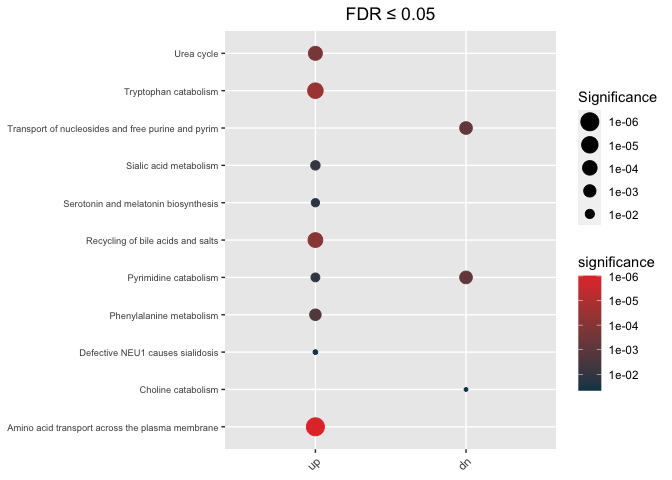
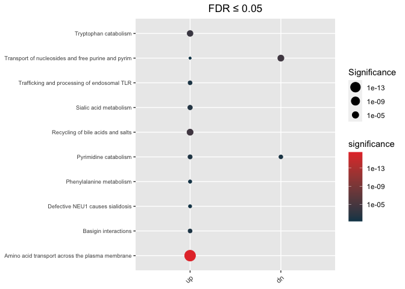
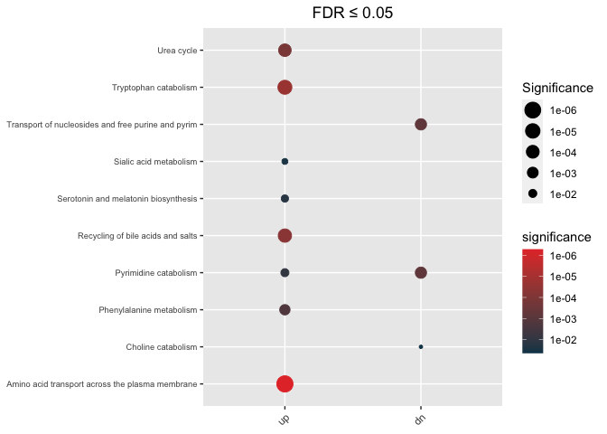

<!-- README.md is generated from README.Rmd. Please edit that file -->


# hypeR.GEM


# Installation

- Using `devtools` package

```r
library(devtools)
devtools::install_github("montilab/hypeR-GEM")
```

# Usage

Here, we are using a dataset of coronavirus disease 2019 (COVID-19) metabolite signatures obtained from human urine samples.

## (i) Load R packages


```r
library(hypeR.GEM)
```


## (ii) Load metabolite signatures

The dataset is a list object containing two data frames:

- up = up-regulated metabolites

- dn = down-regulated metabolites


```r
data(COVID_urine)
str(COVID_urine)
List of 2
 $ up:'data.frame':	161 obs. of  5 variables:
  ..$ metabolite    : chr [1:161] "(S)-a-amino-omega-caprolactam" "1,5-anhydroglucitol (1,5-AG)" "1-methyladenine" "1-methylguanine" ...
  ..$ refmet_name   : chr [1:161] "L-2-aminohexano-6-lactam" "1,5-Anhydrosorbitol" "1-Methyladenine" "1-Methylguanine" ...
  ..$ estimate      : chr [1:161] "0.29434017200000001" "2.5732795230000001" "0.71437854700000003" "1.168429911" ...
  ..$ P_value_adjust: num [1:161] 7.27e-03 1.93e-11 3.14e-02 1.29e-02 2.66e-02 ...
  ..$ gene_type     : chr [1:161] "up" "up" "up" "up" ...
 $ dn:'data.frame':	206 obs. of  5 variables:
  ..$ metabolite    : chr [1:206] "1,2,3-benzenetriol sulfate (1)" "1,3,7-trimethylurate" "1,7-dimethylurate" "1-methyl-5-imidazoleacetate" ...
  ..$ refmet_name   : chr [1:206] NA "1,3,7-Trimethyluric acid" "1,7-Dimethyluric acid" "1-Methyl-5-imidazoleacetic acid" ...
  ..$ estimate      : chr [1:206] "-2.9115951029999998" "-3.7085696989999999" "-3.6453960510000001" "-1.2098657509999999" ...
  ..$ P_value_adjust: num [1:206] 0.0258 0.049 0.0387 0.0483 0.0369 ...
  ..$ gene_type     : chr [1:206] "dn" "dn" "dn" "dn" ...
```

## (iii) hypeR-GEM mapping

- `signature`: Must be a named list, each element is a data frame which has to contain a column with the same name as "reference_key"
- `species`: c("Human", "Mouse", "Rat", "Zebrafish", "Worm", "Other")
- `directional` logical parameter, if TRUE, map metabolites to reactions where these metabolites are product only
-  `merge`: Merge metabolites from different department
- `promiscuous_threshold`: Gene association threshold of promiscuous metabolites
- `ensemble_id`: for current version, if `species != 'Human`, use `ensemble_id = FALSE`
- `reference_key = 'refmet_name` by default
- `background` is used to compute gene-specific p-values, if `background = NULL`, then background = # of metabolites associated with non-exchange reactions


```r
## Undirectional mapping
hypeR_GEM_obj <- hypeR.GEM::signature2gene(signatures = COVID_urine,
                                           directional = FALSE,
                                           species = "Human",
                                           merge = TRUE,
                                           promiscuous_threshold = 50,
                                           ensemble_id = TRUE,
                                           reference_key = 'refmet_name',
                                           background = NULL)

##Directional mapping
hypeR_GEM_obj_di <- hypeR.GEM::signature2gene(signatures = COVID_urine,
                                           directional = TRUE,
                                           species = "Human",
                                           merge = TRUE,
                                           promiscuous_threshold = 50,
                                           ensemble_id = TRUE,
                                           reference_key = 'refmet_name',
                                           background = NULL)
```

## (iv) Enrichment analysis in the gene space

Here we use REACTOME genesets as an example


```r
data(Reactome)
```


### Unweighted(regular) Hypergeometric test

The background we use in this analysis equals to all protein(-coding) genes in the Human GEM model


```r
max_fdr <- 0.05

## Enrichment analysis from undirectional mapping
enrichment <- hypeR.GEM::enrichment(hypeR_GEM_obj,
                                    genesets = Reactome$genesets,
                                    genesets_name = "REACTOME",
                                    method='unweighted',
                                    min_metabolite = 2,
                                    background=3068)

## Enrichment analysis from undirectional mapping
enrichment_di <- hypeR.GEM::enrichment(hypeR_GEM_obj_di,
                                       genesets = Reactome$genesets,
                                       genesets_name = "REACTOME",
                                       method='unweighted',
                                       min_metabolite = 2,
                                       background=3068)
```

#### Visualization of enrichment analysis {.tabset}

##### Undirectional

```r
hypeR.GEM::enrichment_plot(enrichment,
                           top=40,
                           abrv=50,
                           size_by="significance",
                           fdr_cutoff= max_fdr,
                           val='fdr')+
  ggplot2::ggtitle(paste("FDR ≤", max_fdr)) +
  ggplot2::theme(axis.text.y = element_text(size = 7))
```



##### Directional

```r
hypeR.GEM::enrichment_plot(enrichment_di,
                           top=40,
                           abrv=50,
                           size_by="significance",
                           fdr_cutoff= max_fdr,
                           val='fdr')+
  ggplot2::ggtitle(paste("FDR ≤", max_fdr)) +
  ggplot2::theme(axis.text.y = element_text(size = 7))
```



#### Reactable {.tabset}

##### Undirectional

```r
hypeR.GEM::rctbls(enrichment, fdr_cutoff=max_fdr)
```

<!--html_preserve--><div class="rctbl-outer-obj">
<div class="reactable html-widget html-fill-item-overflow-hidden html-fill-item" id="htmlwidget-08c5e20732d3fdab586f" style="width:auto;height:auto;"></div>
<script type="application/json" data-for="htmlwidget-08c5e20732d3fdab586f">{"x":{"tag":{"name":"Reactable","attribs":{"data":{"signature":["up","dn"],"size":[208,200],"enriched":[9,3],"gsets":["REACTOME","REACTOME"],"bg":[3068,3068]},"columns":[{"id":".details","name":"","type":null,"headerClassName":"rctbl-outer-header","sortable":false,"resizable":false,"filterable":false,"searchable":false,"width":45,"align":"center","details":[{"name":"div","attribs":{"className":"rctbl-inner-obj"},"children":[{"name":"Reactable","attribs":{"data":{"label":["Amino acid transport across the plasma membrane","Defective NEU1 causes sialidosis","Phenylalanine metabolism","Pyrimidine catabolism","Recycling of bile acids and salts","Serotonin and melatonin biosynthesis","Sialic acid metabolism","Tryptophan catabolism","Urea cycle"],"pval":[6.3e-10,0.00031,7.8e-06,5.9e-05,1.9e-07,9.7e-05,3.8e-05,3.8e-08,6e-07],"fdr":[9.8e-07,0.044,0.002,0.012,7.6e-05,0.016,0.0086,3e-05,0.00019],"geneset":[33,3,6,12,16,5,33,14,10],"overlap":[15,3,5,6,9,4,10,9,7],"weighted_overlap":[15,3,5,6,9,4,10,9,7],"gene_hits":["SLC1A4;SLC36A1;SLC38A4;SLC3A1;SLC3A2;SLC43A1;SLC43A2;SLC7A1;SLC7A11;SLC7A2;SLC7A3;SLC7A5;SLC7A6;SLC7A8;SLC7A9","CTSA;GLB1;NEU1","ASRGL1;KYAT1;PAH;PCBD1;QDPR","NT5C;NT5C1A;NT5C3A;NT5E;NT5M;TYMP","ABCB11;ABCC3;ALB;BAAT;SLC10A1;SLC10A2;SLCO1A2;SLCO1B1;SLCO1B3","ASMT;DDC;TPH1;TPH2","CMAS;CTSA;GLB1;NANP;NEU1;NEU2;NEU3;NEU4;NPL;SLC17A5","AADAT;AFMID;HAAO;KMO;KYAT1;KYAT3;KYNU;SLC3A2;SLC7A5","ARG1;ARG2;ASS1;NAGS;OTC;SLC25A15;SLC25A2"],"metabolite_hits":["Hydroxykynurenine;Ornithine;Aspartic acid;Cystine;Glycocholic acid;Kynurenine","Aspartic acid;N-Acetylneuraminic acid","2-Keto-glutaramic acid;Hydroxykynurenine;Kynurenic acid;Kynurenine;Aspartic acid;4a-Carbinolamine tetrahydrobiopterin","Deoxyguanosine;Guanosine;Deoxyinosine","Aspartic acid;Glycochenodeoxycholic acid;Glycocholic acid;Glycoursodeoxycholic acid;Glycochenodeoxycholic acid 3-sulfate;Glycodeoxycholic acid 3-sulfate;Taurochenodeoxycholic acid 3-sulfate;Taurodeoxycholic acid 3-sulfate","Hydroxykynurenine;5-Hydroxyindoleacetic acid;4a-Carbinolamine tetrahydrobiopterin","Aspartic acid;N-Acetylneuraminic acid;Glucuronic acid","2-Keto-glutaramic acid;Hydroxykynurenine;Kynurenic acid;Kynurenine;3-Hydroxyanthranilic acid;Ornithine;Cystine","Aspartic acid;N-Acetylmethionine;Ornithine"]},"columns":[{"id":"label","name":"Label","type":"character","headerClassName":"rctbl-inner-header","minWidth":300},{"id":"pval","name":"P-Value","type":"numeric","headerClassName":"rctbl-inner-header"},{"id":"fdr","name":"FDR","type":"numeric","headerClassName":"rctbl-inner-header"},{"id":"geneset","name":"Geneset Size","type":"numeric","headerClassName":"rctbl-inner-header"},{"id":"overlap","name":"Overlap","type":"numeric","headerClassName":"rctbl-inner-header"},{"id":"weighted_overlap","name":"Weighted overlap","type":"numeric","headerClassName":"rctbl-inner-header"},{"id":"gene_hits","name":"Gene Hits","type":"character","headerClassName":"rctbl-inner-header"},{"id":"metabolite_hits","name":"metabolite_hits","type":"character","headerClassName":"rctbl-inner-header"}],"resizable":true,"searchable":true,"showPageSizeOptions":false,"compact":true,"className":"rctbl-inner-tbl","dataKey":"ee4e3ac9ae48a597be1b91852e35b372","static":false,"nested":true},"children":[]}]},{"name":"div","attribs":{"className":"rctbl-inner-obj"},"children":[{"name":"Reactable","attribs":{"data":{"label":["Choline catabolism","Pyrimidine catabolism","Transport of nucleosides and free purine and pyrimidine bases across the plasma membrane"],"pval":[0.00024,2.7e-06,2.7e-06],"fdr":[0.046,0.00071,0.00071],"geneset":[6,12,12],"overlap":[4,7,7],"weighted_overlap":[4,7,7],"gene_hits":["ALDH7A1;BHMT;DMGDH;SARDH","DPYD;NT5C;NT5C1A;NT5C3A;NT5E;NT5M;TYMP","SLC28A1;SLC28A2;SLC28A3;SLC29A1;SLC29A2;SLC29A3;SLC29A4"],"metabolite_hits":["Dimethylglycine;Methylmalonic acid","Adenosine;D-Ribosylnicotinate;Thymine","Adenosine;Serotonin;Tryptamine;Tyramine;Thymine"]},"columns":[{"id":"label","name":"Label","type":"character","headerClassName":"rctbl-inner-header","minWidth":300},{"id":"pval","name":"P-Value","type":"numeric","headerClassName":"rctbl-inner-header"},{"id":"fdr","name":"FDR","type":"numeric","headerClassName":"rctbl-inner-header"},{"id":"geneset","name":"Geneset Size","type":"numeric","headerClassName":"rctbl-inner-header"},{"id":"overlap","name":"Overlap","type":"numeric","headerClassName":"rctbl-inner-header"},{"id":"weighted_overlap","name":"Weighted overlap","type":"numeric","headerClassName":"rctbl-inner-header"},{"id":"gene_hits","name":"Gene Hits","type":"character","headerClassName":"rctbl-inner-header"},{"id":"metabolite_hits","name":"metabolite_hits","type":"character","headerClassName":"rctbl-inner-header"}],"resizable":true,"searchable":true,"showPageSizeOptions":false,"compact":true,"className":"rctbl-inner-tbl","dataKey":"0b5b8be803c1454233ccc35e4f55fe06","static":false,"nested":true},"children":[]}]}]},{"id":"signature","name":"Signature","type":"character","headerClassName":"rctbl-outer-header","minWidth":300},{"id":"size","name":"Signature Size","type":"numeric","headerClassName":"rctbl-outer-header"},{"id":"enriched","name":"Enriched Genesets","type":"numeric","headerClassName":"rctbl-outer-header"},{"id":"gsets","name":"Genesets","type":"character","headerClassName":"rctbl-outer-header"},{"id":"bg","name":"Background","type":"numeric","headerClassName":"rctbl-outer-header"}],"resizable":true,"showPageSizeOptions":false,"onClick":"expand","nowrap":true,"className":"rctbl-outer-tbl","rowStyle":{"cursor":"pointer"},"dataKey":"0898be843fe19cbdede9a5f5e4fce53e"},"children":[]},"class":"reactR_markup"},"evals":[],"jsHooks":[]}</script>
</div><!--/html_preserve-->

##### Directional

```r
hypeR.GEM::rctbls(enrichment_di, fdr_cutoff=max_fdr)
```

<!--html_preserve--><div class="rctbl-outer-obj">
<div class="reactable html-widget html-fill-item-overflow-hidden html-fill-item" id="htmlwidget-ea48a105947a33d9017f" style="width:auto;height:auto;"></div>
<script type="application/json" data-for="htmlwidget-ea48a105947a33d9017f">{"x":{"tag":{"name":"Reactable","attribs":{"data":{"signature":["up","dn"],"size":[179,127],"enriched":[10,2],"gsets":["REACTOME","REACTOME"],"bg":[3068,3068]},"columns":[{"id":".details","name":"","type":null,"headerClassName":"rctbl-outer-header","sortable":false,"resizable":false,"filterable":false,"searchable":false,"width":45,"align":"center","details":[{"name":"div","attribs":{"className":"rctbl-inner-obj"},"children":[{"name":"Reactable","attribs":{"data":{"label":["Amino acid transport across the plasma membrane","Basigin interactions","Defective NEU1 causes sialidosis","Phenylalanine metabolism","Pyrimidine catabolism","Recycling of bile acids and salts","Sialic acid metabolism","Trafficking and processing of endosomal TLR","Transport of nucleosides and free purine and pyrimidine bases across the plasma membrane","Tryptophan catabolism"],"pval":[2.2e-20,5.3e-05,0.0002,0.00015,2.5e-05,5.2e-08,1e-05,4.4e-05,0.00036,2.6e-07],"fdr":[3.5e-17,0.012,0.031,0.027,0.0078,4e-05,0.004,0.012,0.047,0.00013],"geneset":[33,25,3,6,12,16,33,13,12,14],"overlap":[22,8,3,4,6,9,10,6,5,8],"weighted_overlap":[22,8,3,4,6,9,10,6,5,8],"gene_hits":["SLC16A10;SLC1A4;SLC36A1;SLC38A1;SLC38A2;SLC38A4;SLC3A1;SLC3A2;SLC43A1;SLC43A2;SLC6A14;SLC6A18;SLC6A19;SLC7A1;SLC7A11;SLC7A2;SLC7A3;SLC7A5;SLC7A6;SLC7A7;SLC7A8;SLC7A9","SLC16A1;SLC3A2;SLC7A11;SLC7A5;SLC7A6;SLC7A7;SLC7A8;SLC7A9","CTSA;GLB1;NEU1","ASRGL1;KYAT1;PAH;PCBD1","NT5C;NT5C1A;NT5C3A;NT5E;NT5M;TYMP","ABCB11;ABCC3;ALB;BAAT;SLC10A1;SLC10A2;SLCO1A2;SLCO1B1;SLCO1B3","CMAS;CTSA;GLB1;NANP;NEU1;NEU2;NEU3;NEU4;NPL;SLC17A5","CTSB;CTSK;CTSL;CTSS;CTSV;LGMN","SLC28A2;SLC28A3;SLC29A1;SLC29A2;SLC29A3","AADAT;AFMID;KMO;KYAT1;KYAT3;KYNU;SLC3A2;SLC7A5"],"metabolite_hits":["Hydroxykynurenine;Ornithine;Phenylalanine;Aspartic acid;Cystine;Glycocholic acid;Kynurenine","2-Hydroxyphenylacetic acid;Hydroxykynurenine;Ornithine;Phenylalanine;Cystine;Glycocholic acid;Kynurenine","Aspartic acid;N-Acetylneuraminic acid;Phenylalanine","2-Keto-glutaramic acid;Kynurenine;Aspartic acid;4a-Carbinolamine tetrahydrobiopterin","Deoxyguanosine;Guanosine;Deoxyinosine","Aspartic acid;Phenylalanine;Glycochenodeoxycholic acid;Glycocholic acid;Glycoursodeoxycholic acid;Glycochenodeoxycholic acid 3-sulfate;Glycodeoxycholic acid 3-sulfate;Taurochenodeoxycholic acid 3-sulfate;Taurodeoxycholic acid 3-sulfate","Aspartic acid;N-Acetylneuraminic acid;Phenylalanine;Glucuronic acid","Aspartic acid;Phenylalanine","Cytosine;Deoxyguanosine;Deoxyinosine;Guanosine","2-Keto-glutaramic acid;Kynurenine;Kynurenic acid;3-Hydroxyanthranilic acid;Hydroxykynurenine;Ornithine;Phenylalanine;Cystine"]},"columns":[{"id":"label","name":"Label","type":"character","headerClassName":"rctbl-inner-header","minWidth":300},{"id":"pval","name":"P-Value","type":"numeric","headerClassName":"rctbl-inner-header"},{"id":"fdr","name":"FDR","type":"numeric","headerClassName":"rctbl-inner-header"},{"id":"geneset","name":"Geneset Size","type":"numeric","headerClassName":"rctbl-inner-header"},{"id":"overlap","name":"Overlap","type":"numeric","headerClassName":"rctbl-inner-header"},{"id":"weighted_overlap","name":"Weighted overlap","type":"numeric","headerClassName":"rctbl-inner-header"},{"id":"gene_hits","name":"Gene Hits","type":"character","headerClassName":"rctbl-inner-header"},{"id":"metabolite_hits","name":"metabolite_hits","type":"character","headerClassName":"rctbl-inner-header"}],"resizable":true,"searchable":true,"showPageSizeOptions":false,"compact":true,"className":"rctbl-inner-tbl","dataKey":"87869cf0556e5c4d8cd3477f54f2e7bd","static":false,"nested":true},"children":[]}]},{"name":"div","attribs":{"className":"rctbl-inner-obj"},"children":[{"name":"Reactable","attribs":{"data":{"label":["Pyrimidine catabolism","Transport of nucleosides and free purine and pyrimidine bases across the plasma membrane"],"pval":[7e-05,1.2e-07],"fdr":[0.014,3.7e-05],"geneset":[12,12],"overlap":[5,7],"weighted_overlap":[5,7],"gene_hits":["NT5C;NT5C1A;NT5C3A;NT5E;NT5M","SLC28A1;SLC28A2;SLC28A3;SLC29A1;SLC29A2;SLC29A3;SLC29A4"],"metabolite_hits":["Adenosine;D-Ribosylnicotinate","Adenosine;Serotonin;Tryptamine;Tyramine;Thymine"]},"columns":[{"id":"label","name":"Label","type":"character","headerClassName":"rctbl-inner-header","minWidth":300},{"id":"pval","name":"P-Value","type":"numeric","headerClassName":"rctbl-inner-header"},{"id":"fdr","name":"FDR","type":"numeric","headerClassName":"rctbl-inner-header"},{"id":"geneset","name":"Geneset Size","type":"numeric","headerClassName":"rctbl-inner-header"},{"id":"overlap","name":"Overlap","type":"numeric","headerClassName":"rctbl-inner-header"},{"id":"weighted_overlap","name":"Weighted overlap","type":"numeric","headerClassName":"rctbl-inner-header"},{"id":"gene_hits","name":"Gene Hits","type":"character","headerClassName":"rctbl-inner-header"},{"id":"metabolite_hits","name":"metabolite_hits","type":"character","headerClassName":"rctbl-inner-header"}],"resizable":true,"searchable":true,"showPageSizeOptions":false,"compact":true,"className":"rctbl-inner-tbl","dataKey":"886803a66967bff9b06af14af5462dd6","static":false,"nested":true},"children":[]}]}]},{"id":"signature","name":"Signature","type":"character","headerClassName":"rctbl-outer-header","minWidth":300},{"id":"size","name":"Signature Size","type":"numeric","headerClassName":"rctbl-outer-header"},{"id":"enriched","name":"Enriched Genesets","type":"numeric","headerClassName":"rctbl-outer-header"},{"id":"gsets","name":"Genesets","type":"character","headerClassName":"rctbl-outer-header"},{"id":"bg","name":"Background","type":"numeric","headerClassName":"rctbl-outer-header"}],"resizable":true,"showPageSizeOptions":false,"onClick":"expand","nowrap":true,"className":"rctbl-outer-tbl","rowStyle":{"cursor":"pointer"},"dataKey":"9fddf81812579d9ff03ad35e1d64a273"},"children":[]},"class":"reactR_markup"},"evals":[],"jsHooks":[]}</script>
</div><!--/html_preserve-->


### Weighted Hypergeometric test {.tabset}


```r
max_fdr <- 0.05

## Enrichment analysis from undirectional mapping
enrichment_wt <- hypeR.GEM::enrichment(hypeR_GEM_obj,
                                        genesets = Reactome$genesets,
                                        genesets_name = "REACTOME",
                                        method='weighted',
                                        weights = 'one_minus_fdr',
                                        min_metabolite = 2,
                                        background=3068)

## Enrichment analysis from Directional mapping
enrichment_wt_di <- hypeR.GEM::enrichment(hypeR_GEM_obj_di,
                                        genesets = Reactome$genesets,
                                        genesets_name = "REACTOME",
                                        method='weighted',
                                        weights = 'one_minus_fdr',
                                        min_metabolite = 2,
                                        background=3068)
```


#### Visualization of enrichment analysis {.tabset}

##### Undirectional

```r
hypeR.GEM::enrichment_plot(enrichment_wt,
                           top=40,
                           abrv=50,
                           size_by="significance",
                           fdr_cutoff= max_fdr,
                           val='fdr')+
  ggplot2::ggtitle(paste("FDR ≤", max_fdr)) +
  ggplot2::theme(axis.text.y = element_text(size = 7))
```



##### Directional

```r
hypeR.GEM::enrichment_plot(enrichment_wt_di,
                           top=40,
                           abrv=50,
                           size_by="significance",
                           fdr_cutoff= max_fdr,
                           val='fdr')+
  ggplot2::ggtitle(paste("FDR ≤", max_fdr)) +
  ggplot2::theme(axis.text.y = element_text(size = 7))
```


#### Reactable {.tabset}

##### Undirectional

```r
hypeR.GEM::rctbls(enrichment_wt, fdr_cutoff=max_fdr)
```

<!--html_preserve--><div class="rctbl-outer-obj">
<div class="reactable html-widget html-fill-item-overflow-hidden html-fill-item" id="htmlwidget-90f58a23a950d2ff7316" style="width:auto;height:auto;"></div>
<script type="application/json" data-for="htmlwidget-90f58a23a950d2ff7316">{"x":{"tag":{"name":"Reactable","attribs":{"data":{"signature":["up","dn"],"size":[208,200],"enriched":[8,3],"gsets":["REACTOME","REACTOME"],"bg":[3068,3068]},"columns":[{"id":".details","name":"","type":null,"headerClassName":"rctbl-outer-header","sortable":false,"resizable":false,"filterable":false,"searchable":false,"width":45,"align":"center","details":[{"name":"div","attribs":{"className":"rctbl-inner-obj"},"children":[{"name":"Reactable","attribs":{"data":{"label":["Amino acid transport across the plasma membrane","Phenylalanine metabolism","Pyrimidine catabolism","Recycling of bile acids and salts","Serotonin and melatonin biosynthesis","Sialic acid metabolism","Tryptophan catabolism","Urea cycle"],"pval":[3.3e-10,6.2e-06,4.6e-05,1.3e-07,8.2e-05,0.00017,2.6e-08,4.4e-07],"fdr":[5.2e-07,0.0016,0.01,5.1e-05,0.016,0.029,2e-05,0.00014],"geneset":[33,6,12,16,5,33,14,10],"overlap":[15,5,6,9,4,10,9,7],"weighted_overlap":[15,5,6,9,4,9,9,7],"gene_hits":["SLC1A4;SLC36A1;SLC38A4;SLC3A1;SLC3A2;SLC43A1;SLC43A2;SLC7A1;SLC7A11;SLC7A2;SLC7A3;SLC7A5;SLC7A6;SLC7A8;SLC7A9","ASRGL1;KYAT1;PAH;PCBD1;QDPR","NT5C;NT5C1A;NT5C3A;NT5E;NT5M;TYMP","ABCB11;ABCC3;ALB;BAAT;SLC10A1;SLC10A2;SLCO1A2;SLCO1B1;SLCO1B3","ASMT;DDC;TPH1;TPH2","CMAS;CTSA;GLB1;NANP;NEU1;NEU2;NEU3;NEU4;NPL;SLC17A5","AADAT;AFMID;HAAO;KMO;KYAT1;KYAT3;KYNU;SLC3A2;SLC7A5","ARG1;ARG2;ASS1;NAGS;OTC;SLC25A15;SLC25A2"],"metabolite_hits":["Hydroxykynurenine;Ornithine;Aspartic acid;Cystine;Glycocholic acid;Kynurenine","2-Keto-glutaramic acid;Hydroxykynurenine;Kynurenic acid;Kynurenine;Aspartic acid;4a-Carbinolamine tetrahydrobiopterin","Deoxyguanosine;Guanosine;Deoxyinosine","Aspartic acid;Glycochenodeoxycholic acid;Glycocholic acid;Glycoursodeoxycholic acid;Glycochenodeoxycholic acid 3-sulfate;Glycodeoxycholic acid 3-sulfate;Taurochenodeoxycholic acid 3-sulfate;Taurodeoxycholic acid 3-sulfate","Hydroxykynurenine;5-Hydroxyindoleacetic acid;4a-Carbinolamine tetrahydrobiopterin","Aspartic acid;N-Acetylneuraminic acid;Glucuronic acid","2-Keto-glutaramic acid;Hydroxykynurenine;Kynurenic acid;Kynurenine;3-Hydroxyanthranilic acid;Ornithine;Cystine","Aspartic acid;N-Acetylmethionine;Ornithine"]},"columns":[{"id":"label","name":"Label","type":"character","headerClassName":"rctbl-inner-header","minWidth":300},{"id":"pval","name":"P-Value","type":"numeric","headerClassName":"rctbl-inner-header"},{"id":"fdr","name":"FDR","type":"numeric","headerClassName":"rctbl-inner-header"},{"id":"geneset","name":"Geneset Size","type":"numeric","headerClassName":"rctbl-inner-header"},{"id":"overlap","name":"Overlap","type":"numeric","headerClassName":"rctbl-inner-header"},{"id":"weighted_overlap","name":"Weighted overlap","type":"numeric","headerClassName":"rctbl-inner-header"},{"id":"gene_hits","name":"Gene Hits","type":"character","headerClassName":"rctbl-inner-header"},{"id":"metabolite_hits","name":"metabolite_hits","type":"character","headerClassName":"rctbl-inner-header"}],"resizable":true,"searchable":true,"showPageSizeOptions":false,"compact":true,"className":"rctbl-inner-tbl","dataKey":"b5603300a6ced1530b8f507650cc78f1","static":false,"nested":true},"children":[]}]},{"name":"div","attribs":{"className":"rctbl-inner-obj"},"children":[{"name":"Reactable","attribs":{"data":{"label":["Choline catabolism","Pyrimidine catabolism","Transport of nucleosides and free purine and pyrimidine bases across the plasma membrane"],"pval":[0.00022,2.4e-06,2.4e-06],"fdr":[0.044,0.00064,0.00064],"geneset":[6,12,12],"overlap":[4,7,7],"weighted_overlap":[4,7,7],"gene_hits":["ALDH7A1;BHMT;DMGDH;SARDH","DPYD;NT5C;NT5C1A;NT5C3A;NT5E;NT5M;TYMP","SLC28A1;SLC28A2;SLC28A3;SLC29A1;SLC29A2;SLC29A3;SLC29A4"],"metabolite_hits":["Dimethylglycine;Methylmalonic acid","Adenosine;D-Ribosylnicotinate;Thymine","Adenosine;Serotonin;Tryptamine;Tyramine;Thymine"]},"columns":[{"id":"label","name":"Label","type":"character","headerClassName":"rctbl-inner-header","minWidth":300},{"id":"pval","name":"P-Value","type":"numeric","headerClassName":"rctbl-inner-header"},{"id":"fdr","name":"FDR","type":"numeric","headerClassName":"rctbl-inner-header"},{"id":"geneset","name":"Geneset Size","type":"numeric","headerClassName":"rctbl-inner-header"},{"id":"overlap","name":"Overlap","type":"numeric","headerClassName":"rctbl-inner-header"},{"id":"weighted_overlap","name":"Weighted overlap","type":"numeric","headerClassName":"rctbl-inner-header"},{"id":"gene_hits","name":"Gene Hits","type":"character","headerClassName":"rctbl-inner-header"},{"id":"metabolite_hits","name":"metabolite_hits","type":"character","headerClassName":"rctbl-inner-header"}],"resizable":true,"searchable":true,"showPageSizeOptions":false,"compact":true,"className":"rctbl-inner-tbl","dataKey":"f2d1c554e3ded5919a19a6c11f55564e","static":false,"nested":true},"children":[]}]}]},{"id":"signature","name":"Signature","type":"character","headerClassName":"rctbl-outer-header","minWidth":300},{"id":"size","name":"Signature Size","type":"numeric","headerClassName":"rctbl-outer-header"},{"id":"enriched","name":"Enriched Genesets","type":"numeric","headerClassName":"rctbl-outer-header"},{"id":"gsets","name":"Genesets","type":"character","headerClassName":"rctbl-outer-header"},{"id":"bg","name":"Background","type":"numeric","headerClassName":"rctbl-outer-header"}],"resizable":true,"showPageSizeOptions":false,"onClick":"expand","nowrap":true,"className":"rctbl-outer-tbl","rowStyle":{"cursor":"pointer"},"dataKey":"3b86dd24fc2dfdef9cbc3e1f35a2a2b2"},"children":[]},"class":"reactR_markup"},"evals":[],"jsHooks":[]}</script>
</div><!--/html_preserve-->

##### Directional

```r
hypeR.GEM::rctbls(enrichment_wt_di, fdr_cutoff=max_fdr)
```

<!--html_preserve--><div class="rctbl-outer-obj">
<div class="reactable html-widget html-fill-item-overflow-hidden html-fill-item" id="htmlwidget-d6e598a0669526a930ec" style="width:auto;height:auto;"></div>
<script type="application/json" data-for="htmlwidget-d6e598a0669526a930ec">{"x":{"tag":{"name":"Reactable","attribs":{"data":{"signature":["up","dn"],"size":[179,127],"enriched":[10,2],"gsets":["REACTOME","REACTOME"],"bg":[3068,3068]},"columns":[{"id":".details","name":"","type":null,"headerClassName":"rctbl-outer-header","sortable":false,"resizable":false,"filterable":false,"searchable":false,"width":45,"align":"center","details":[{"name":"div","attribs":{"className":"rctbl-inner-obj"},"children":[{"name":"Reactable","attribs":{"data":{"label":["Amino acid transport across the plasma membrane","Basigin interactions","Defective NEU1 causes sialidosis","Phenylalanine metabolism","Pyrimidine catabolism","Recycling of bile acids and salts","Sialic acid metabolism","Trafficking and processing of endosomal TLR","Transport of nucleosides and free purine and pyrimidine bases across the plasma membrane","Tryptophan catabolism"],"pval":[1.3e-20,4.5e-05,0.00018,0.00014,2.2e-05,4.2e-08,8.3e-06,3.9e-05,0.00033,2.1e-07],"fdr":[2.1e-17,0.01,0.029,0.024,0.0069,3.3e-05,0.0033,0.01,0.043,0.00011],"geneset":[33,25,3,6,12,16,33,13,12,14],"overlap":[22,8,3,4,6,9,10,6,5,8],"weighted_overlap":[22,8,3,4,6,9,10,6,5,8],"gene_hits":["SLC16A10;SLC1A4;SLC36A1;SLC38A1;SLC38A2;SLC38A4;SLC3A1;SLC3A2;SLC43A1;SLC43A2;SLC6A14;SLC6A18;SLC6A19;SLC7A1;SLC7A11;SLC7A2;SLC7A3;SLC7A5;SLC7A6;SLC7A7;SLC7A8;SLC7A9","SLC16A1;SLC3A2;SLC7A11;SLC7A5;SLC7A6;SLC7A7;SLC7A8;SLC7A9","CTSA;GLB1;NEU1","ASRGL1;KYAT1;PAH;PCBD1","NT5C;NT5C1A;NT5C3A;NT5E;NT5M;TYMP","ABCB11;ABCC3;ALB;BAAT;SLC10A1;SLC10A2;SLCO1A2;SLCO1B1;SLCO1B3","CMAS;CTSA;GLB1;NANP;NEU1;NEU2;NEU3;NEU4;NPL;SLC17A5","CTSB;CTSK;CTSL;CTSS;CTSV;LGMN","SLC28A2;SLC28A3;SLC29A1;SLC29A2;SLC29A3","AADAT;AFMID;KMO;KYAT1;KYAT3;KYNU;SLC3A2;SLC7A5"],"metabolite_hits":["Hydroxykynurenine;Ornithine;Phenylalanine;Aspartic acid;Cystine;Glycocholic acid;Kynurenine","2-Hydroxyphenylacetic acid;Hydroxykynurenine;Ornithine;Phenylalanine;Cystine;Glycocholic acid;Kynurenine","Aspartic acid;N-Acetylneuraminic acid;Phenylalanine","2-Keto-glutaramic acid;Kynurenine;Aspartic acid;4a-Carbinolamine tetrahydrobiopterin","Deoxyguanosine;Guanosine;Deoxyinosine","Aspartic acid;Phenylalanine;Glycochenodeoxycholic acid;Glycocholic acid;Glycoursodeoxycholic acid;Glycochenodeoxycholic acid 3-sulfate;Glycodeoxycholic acid 3-sulfate;Taurochenodeoxycholic acid 3-sulfate;Taurodeoxycholic acid 3-sulfate","Aspartic acid;N-Acetylneuraminic acid;Phenylalanine;Glucuronic acid","Aspartic acid;Phenylalanine","Cytosine;Deoxyguanosine;Deoxyinosine;Guanosine","2-Keto-glutaramic acid;Kynurenine;Kynurenic acid;3-Hydroxyanthranilic acid;Hydroxykynurenine;Ornithine;Phenylalanine;Cystine"]},"columns":[{"id":"label","name":"Label","type":"character","headerClassName":"rctbl-inner-header","minWidth":300},{"id":"pval","name":"P-Value","type":"numeric","headerClassName":"rctbl-inner-header"},{"id":"fdr","name":"FDR","type":"numeric","headerClassName":"rctbl-inner-header"},{"id":"geneset","name":"Geneset Size","type":"numeric","headerClassName":"rctbl-inner-header"},{"id":"overlap","name":"Overlap","type":"numeric","headerClassName":"rctbl-inner-header"},{"id":"weighted_overlap","name":"Weighted overlap","type":"numeric","headerClassName":"rctbl-inner-header"},{"id":"gene_hits","name":"Gene Hits","type":"character","headerClassName":"rctbl-inner-header"},{"id":"metabolite_hits","name":"metabolite_hits","type":"character","headerClassName":"rctbl-inner-header"}],"resizable":true,"searchable":true,"showPageSizeOptions":false,"compact":true,"className":"rctbl-inner-tbl","dataKey":"f73156bab847c3f0873fb6c6d0d0ac65","static":false,"nested":true},"children":[]}]},{"name":"div","attribs":{"className":"rctbl-inner-obj"},"children":[{"name":"Reactable","attribs":{"data":{"label":["Pyrimidine catabolism","Transport of nucleosides and free purine and pyrimidine bases across the plasma membrane"],"pval":[6.5e-05,1.1e-07],"fdr":[0.013,3.3e-05],"geneset":[12,12],"overlap":[5,7],"weighted_overlap":[5,7],"gene_hits":["NT5C;NT5C1A;NT5C3A;NT5E;NT5M","SLC28A1;SLC28A2;SLC28A3;SLC29A1;SLC29A2;SLC29A3;SLC29A4"],"metabolite_hits":["Adenosine;D-Ribosylnicotinate","Adenosine;Serotonin;Tryptamine;Tyramine;Thymine"]},"columns":[{"id":"label","name":"Label","type":"character","headerClassName":"rctbl-inner-header","minWidth":300},{"id":"pval","name":"P-Value","type":"numeric","headerClassName":"rctbl-inner-header"},{"id":"fdr","name":"FDR","type":"numeric","headerClassName":"rctbl-inner-header"},{"id":"geneset","name":"Geneset Size","type":"numeric","headerClassName":"rctbl-inner-header"},{"id":"overlap","name":"Overlap","type":"numeric","headerClassName":"rctbl-inner-header"},{"id":"weighted_overlap","name":"Weighted overlap","type":"numeric","headerClassName":"rctbl-inner-header"},{"id":"gene_hits","name":"Gene Hits","type":"character","headerClassName":"rctbl-inner-header"},{"id":"metabolite_hits","name":"metabolite_hits","type":"character","headerClassName":"rctbl-inner-header"}],"resizable":true,"searchable":true,"showPageSizeOptions":false,"compact":true,"className":"rctbl-inner-tbl","dataKey":"ec093e5b6a90c582e29426413d028cb8","static":false,"nested":true},"children":[]}]}]},{"id":"signature","name":"Signature","type":"character","headerClassName":"rctbl-outer-header","minWidth":300},{"id":"size","name":"Signature Size","type":"numeric","headerClassName":"rctbl-outer-header"},{"id":"enriched","name":"Enriched Genesets","type":"numeric","headerClassName":"rctbl-outer-header"},{"id":"gsets","name":"Genesets","type":"character","headerClassName":"rctbl-outer-header"},{"id":"bg","name":"Background","type":"numeric","headerClassName":"rctbl-outer-header"}],"resizable":true,"showPageSizeOptions":false,"onClick":"expand","nowrap":true,"className":"rctbl-outer-tbl","rowStyle":{"cursor":"pointer"},"dataKey":"6634bf4d9cb0c5df3f44250cb7a23df5"},"children":[]},"class":"reactR_markup"},"evals":[],"jsHooks":[]}</script>
</div><!--/html_preserve-->
