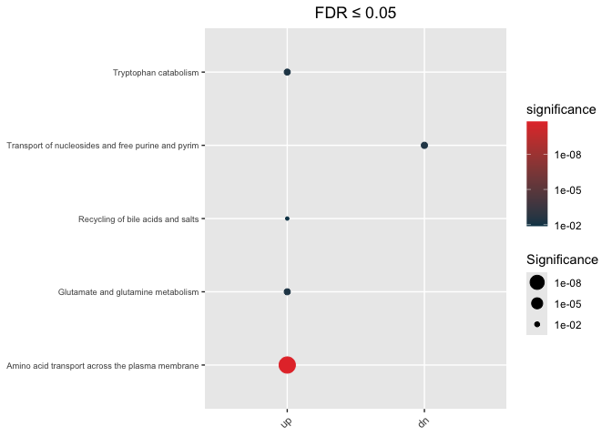

<!-- README.md is generated from README.Rmd. Please edit that file -->

# hypeR.GEM


# Installation

- Using `devtools` package

``` r
library(devtools)
devtools::install_github("montilab/hypeR-GEM")
```

# Usage

Here, we are using a dataset of coronavirus disease 2019 (COVID-19)
metabolite signatures obtained from human urine samples.

## (i) Load R packages

``` r
library(hypeR.GEM)
```

## (ii) Load metabolite signatures

The dataset is a list object containing two data frames:

- up = up-regulated metabolites

- dn = down-regulated metabolites

``` r
data(COVID_urine)
str(COVID_urine)
List of 2
 $ up:'data.frame': 161 obs. of  5 variables:
  ..$ metabolite    : chr [1:161] "(S)-a-amino-omega-caprolactam" "1,5-anhydroglucitol (1,5-AG)" "1-methyladenine" "1-methylguanine" ...
  ..$ refmet_name   : chr [1:161] "L-2-aminohexano-6-lactam" "1,5-Anhydrosorbitol" "1-Methyladenine" "1-Methylguanine" ...
  ..$ estimate      : chr [1:161] "0.29434017200000001" "2.5732795230000001" "0.71437854700000003" "1.168429911" ...
  ..$ P_value_adjust: num [1:161] 7.27e-03 1.93e-11 3.14e-02 1.29e-02 2.66e-02 ...
  ..$ gene_type     : chr [1:161] "up" "up" "up" "up" ...
 $ dn:'data.frame': 206 obs. of  5 variables:
  ..$ metabolite    : chr [1:206] "1,2,3-benzenetriol sulfate (1)" "1,3,7-trimethylurate" "1,7-dimethylurate" "1-methyl-5-imidazoleacetate" ...
  ..$ refmet_name   : chr [1:206] NA "1,3,7-Trimethyluric acid" "1,7-Dimethyluric acid" "1-Methyl-5-imidazoleacetic acid" ...
  ..$ estimate      : chr [1:206] "-2.9115951029999998" "-3.7085696989999999" "-3.6453960510000001" "-1.2098657509999999" ...
  ..$ P_value_adjust: num [1:206] 0.0258 0.049 0.0387 0.0483 0.0369 ...
  ..$ gene_type     : chr [1:206] "dn" "dn" "dn" "dn" ...
```

## (iii) hypeR-GEM mapping

- `signature`: Must be a named list, each element is a data frame which
  has to contain a column with the same name as “reference_key”
- `species`: c(“Human”, “Mouse”, “Rat”, “Zebrafish”, “Worm”, “Other”)
- `directional` logical parameter, if TRUE, map metabolites to reactions
  where these metabolites are product only
- `merge`: Merge metabolites from different department
- `promiscuous_threshold`: Gene association threshold of promiscuous
  metabolites
- `ensemble_id`: for current version, if `species != 'Human`, use
  `ensemble_id = FALSE`
- `reference_key = 'refmet_name` by default
- `background` is used to compute gene-specific p-values, if
  `background = NULL`, then background = \# of metabolites associated
  with non-exchange reactions

``` r
## Undirectional mapping
hypeR_GEM_obj <- hypeR.GEM::signature2gene(signatures = COVID_urine,
                                           directional = FALSE,
                                           species = "Human",
                                           merge = TRUE,
                                           promiscuous_threshold = 500,
                                           ensemble_id = TRUE,
                                           reference_key = 'refmet_name',
                                           background = NULL)


##Directional mapping
hypeR_GEM_obj_di <- hypeR.GEM::signature2gene(signatures = COVID_urine,
                                            directional = TRUE,
                                            species = "Human",
                                            merge = TRUE,
                                            promiscuous_threshold = 500,
                                            ensemble_id = TRUE,
                                            reference_key = 'refmet_name',
                                            background = NULL)
```

## (iv) Enrichment analysis in the gene space

Here we use REACTOME genesets as an example

``` r
data(reactome)
```

### Unweighted (standard) Hypergeometric test

The background we use in this analysis equals to all protein(-coding)
genes in the Human GEM model

``` r
max_fdr <- 0.05

## Enrichment analysis from undirectional mapping
enrichment <- hypeR.GEM::enrichment(hypeR_GEM_obj,
                                    genesets = reactome,
                                    genesets_name = "REACTOME",
                                    method='unweighted',
                                    min_metabolite = 2,
                                    background=3068)


## Enrichment analysis from undirectional mapping
enrichment_di <- hypeR.GEM::enrichment(hypeR_GEM_obj_di,
                                       genesets = reactome,
                                       genesets_name = "REACTOME",
                                       method='unweighted',
                                       min_metabolite = 2,
                                       background=3068)
```

#### Visualization of enrichment analysis

##### Undirectional

``` r
hypeR.GEM::enrichment_plot(enrichment,
                           top=40,
                           abrv=50,
                           size_by="significance",
                           fdr_cutoff= max_fdr,
                           val='fdr')+
  ggplot2::ggtitle(paste("FDR ≤", max_fdr)) +
  ggplot2::theme(axis.text.y = element_text(size = 7))
```

<!-- -->

##### Directional

``` r
hypeR.GEM::enrichment_plot(enrichment_di,
                           top=40,
                           abrv=50,
                           size_by="significance",
                           fdr_cutoff= max_fdr,
                           val='fdr')+
  ggplot2::ggtitle(paste("FDR ≤", max_fdr)) +
  ggplot2::theme(axis.text.y = element_text(size = 7))
```

<!-- -->

### Weighted Hypergeometric test

``` r
max_fdr <- 0.05

## Enrichment analysis from undirectional mapping
enrichment_wt <- hypeR.GEM::enrichment(hypeR_GEM_obj,
                                        genesets = reactome,
                                        genesets_name = "REACTOME",
                                        method='weighted',
                                        weighted_by = 'one_minus_fdr',
                                        min_metabolite = 2,
                                        background=3068)

## Enrichment analysis from Directional mapping
enrichment_wt_di <- hypeR.GEM::enrichment(hypeR_GEM_obj_di,
                                        genesets = reactome,
                                        genesets_name = "REACTOME",
                                        method='weighted',
                                        weighted_by = 'one_minus_fdr',
                                        min_metabolite = 2,
                                        background=3068)
```

#### Visualization of enrichment analysis

##### Undirectional

``` r
hypeR.GEM::enrichment_plot(enrichment_wt,
                           top=40,
                           abrv=50,
                           size_by="significance",
                           fdr_cutoff= max_fdr,
                           val='fdr')+
  ggplot2::ggtitle(paste("FDR ≤", max_fdr)) +
  ggplot2::theme(axis.text.y = element_text(size = 7))
```

<!-- -->

##### Directional

``` r
hypeR.GEM::enrichment_plot(enrichment_wt_di,
                           top=40,
                           abrv=50,
                           size_by="significance",
                           fdr_cutoff= max_fdr,
                           val='fdr')+
  ggplot2::ggtitle(paste("FDR ≤", max_fdr)) +
  ggplot2::theme(axis.text.y = element_text(size = 7))
```

<!-- -->
