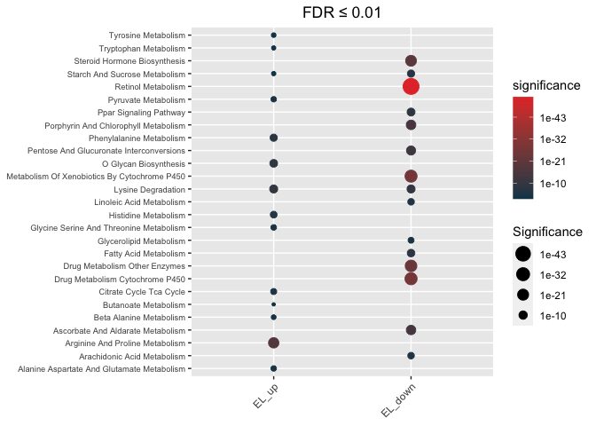
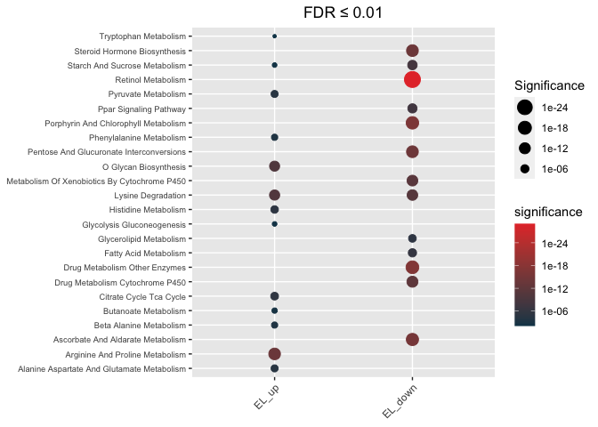

<!-- README.md is generated from README.Rmd. Please edit that file -->

# hypeR.GEM

## (1) Installation

-   Using `devtools` package

``` r
library(devtools)
devtools::install_github("montilab/hypeR-GEM")
```

## Usage

``` r
library(hypeR.GEM)
```

## Load signatures

``` r
data(EL_signature)

str(EL_signature)
```

    #> List of 2
    #>  $ EL_up  :'data.frame': 311 obs. of  5 variables:
    #>   ..$ CHEMICAL_NAME: chr [1:311] "c-glycosyltryptophan" "vanillactate" "hydroxyasparagine**" "cysteine s-sulfate" ...
    #>   ..$ refmet_name  : chr [1:311] "alpha-C-Mannosyltryptophan" "Vanillactic acid" "Hydroxyasparagine" "Cysteine-S-sulfate" ...
    #>   ..$ cent.Estimate: num [1:311] 0.824 1.049 0.858 0.882 1.44 ...
    #>   ..$ cent.p.value : num [1:311] 5.25e-14 3.92e-13 2.69e-12 3.77e-12 6.46e-12 ...
    #>   ..$ cent.q.value : num [1:311] 5.52e-11 2.06e-10 9.42e-10 9.92e-10 1.36e-09 ...
    #>  $ EL_down:'data.frame': 96 obs. of  5 variables:
    #>   ..$ CHEMICAL_NAME: chr [1:96] "epiandrosterone sulfate" "dehydroepiandrosterone sulfate (dhea-s)" "androstenediol (3beta,17beta) monosulfate (1)" "x-11378" ...
    #>   ..$ refmet_name  : chr [1:96] "Epiandrosterone" "Dehydroepiandrosterone sulfate" "4-Androsten-3beta,17beta-diol 17-sulfate" NA ...
    #>   ..$ cent.Estimate: num [1:96] -1.9 -1.44 -1.64 -1.12 -1.75 ...
    #>   ..$ cent.p.value : num [1:96] 7.73e-08 1.35e-07 1.95e-07 6.28e-07 1.07e-06 ...
    #>   ..$ cent.q.value : num [1:96] 1.77e-06 2.91e-06 3.51e-06 9.31e-06 1.40e-05 ...

## Map metabolite signtures to associated genes

-   `signatures` must be a named list
-   `species = c("Human", "Mouse", "Rat", "Zebrafish", "Worm", "Other")`
-   `merge`: merge metabolites from different department
-   `promiscuous_threshold`: gene association threshold of promiscuous
    metabolite
-   `ensemble_id`: for current version, if `species != 'Human`, use
    `ensemble_id = FALSE`
-   `reference_key = 'refmet_name` by default
-   `background` is used to compute gene-specific p-values, if
    `background = NULL`, then background = \# of metabolites associated
    with non-exchange reactions

``` r
hypeR_GEM_obj <- hypeR.GEM::signature2gene(signatures = EL_signature,
                                           species = "Human",
                                           merge = TRUE,
                                           promiscuous_threshold = 50,
                                           ensemble_id = TRUE,
                                           reference_key = 'refmet_name',
                                           background = NULL)


hypeR_GEM_obj$promiscuous_met
```

    #>        refmet_name gene_association
    #> 1    Phenylalanine               57
    #> 2          Proline               57
    #> 3 Arachidonic acid               77
    #> 4    Linoleic acid               62

``` r
library(hypeR)
kegg <- msigdb_gsets(species="Homo sapiens", category="C2", subcategory = "CP:KEGG", clean = TRUE)
print(kegg)
```

    #> C2.CP:KEGG v7.5.1 
    #> Abc Transporters (44)
    #> Acute Myeloid Leukemia (57)
    #> Adherens Junction (73)
    #> Adipocytokine Signaling Pathway (67)
    #> Alanine Aspartate And Glutamate Metabolism (32)
    #> Aldosterone Regulated Sodium Reabsorption (42)

## Hypergeometric test

### KEGG (unweighted)

``` r
max_fdr <- 0.01
hypeR_GEM_enrichments_unweighted <- hypeR.GEM::enrichment(hypeR_GEM_obj,
                                         genesets = kegg$genesets,
                                         genesets_name = "KEGG",
                                         method='unweighted',
                                         background=3068)

hypeR_GEM_enrichments_unweighted$EL_down$info
```

    #> $Test
    #> [1] "Hypergeometric test"
    #> 
    #> $Signature_size
    #> [1] 182
    #> 
    #> $Genesets
    #> [1] "KEGG"
    #> 
    #> $Background
    #> [1] 3068

#### Plot

``` r
hypeR.GEM::enrichment_plot(hypeR_GEM_enrichments_unweighted,
                           top=40,
                           abrv=50,
                           size_by="significance",
                           fdr_cutoff= max_fdr,
                           val='fdr')+
  ggplot2::ggtitle(paste("FDR ≤", max_fdr)) +
  ggplot2::theme(axis.text.y = element_text(size = 7))
```

<!-- -->

#### Reactable

``` r
hypeR.GEM::rctbls(hypeR_GEM_enrichments_unweighted, fdr_cutoff=0.05)
```

<div class="rctbl-outer-obj">
<div class="reactable html-widget html-fill-item-overflow-hidden html-fill-item" id="htmlwidget-28cc5d910f42b74cb2b5" style="width:auto;height:auto;"></div>
<script type="application/json" data-for="htmlwidget-28cc5d910f42b74cb2b5">{"x":{"tag":{"name":"Reactable","attribs":{"data":{"signature":["EL_up","EL_down"],"size":[401,182],"enriched":[17,14],"gsets":["KEGG","KEGG"],"bg":[3068,3068]},"columns":[{"id":".details","name":"","type":null,"headerClassName":"rctbl-outer-header","sortable":false,"resizable":false,"filterable":false,"searchable":false,"width":45,"align":"center","details":[{"name":"div","attribs":{"className":"rctbl-inner-obj"},"children":[{"name":"Reactable","attribs":{"data":{"label":["Alanine Aspartate And Glutamate Metabolism","Arginine And Proline Metabolism","Ascorbate And Aldarate Metabolism","Beta Alanine Metabolism","Butanoate Metabolism","Citrate Cycle Tca Cycle","Drug Metabolism Cytochrome P450","Glycolysis Gluconeogenesis","Histidine Metabolism","Lysine Degradation","O Glycan Biosynthesis","Phenylalanine Metabolism","Propanoate Metabolism","Pyruvate Metabolism","Starch And Sucrose Metabolism","Tryptophan Metabolism","Tyrosine Metabolism"],"pval":[2.9e-06,7.9e-17,0.00068,3e-05,0.00018,2.5e-07,0.0041,0.00021,7.3e-08,5.3e-12,1.2e-11,2.3e-06,0.0022,3.4e-06,5.1e-05,0.00031,0.00055],"fdr":[7.8e-05,1.5e-14,0.0085,0.00063,0.0031,9.4e-06,0.044,0.0032,3.4e-06,4.9e-10,7.3e-10,7e-05,0.025,7.9e-05,0.00096,0.0045,0.0073],"geneset":[32,54,25,22,34,31,72,62,29,44,30,18,33,40,52,40,42],"overlap":[15,33,10,11,13,16,18,19,16,25,20,11,11,17,18,14,14],"weighted_overlap":[15,33,10,11,13,16,18,19,16,25,20,11,11,17,18,14,14],"gene_hits":["ACY3;ADSL;ADSS1;ADSS2;ALDH4A1;ASL;ASNS;ASPA;ASS1;CAD;GAD1;GAD2;GOT1;GOT2;NIT2","ACY1;AGMAT;ALDH1B1;ALDH2;ALDH3A2;ALDH4A1;ALDH7A1;ALDH9A1;AOC1;ARG1;ARG2;ASL;ASS1;CKB;CKM;CKMT1A;CKMT1B;CKMT2;DAO;GAMT;GOT1;GOT2;MAOA;MAOB;NAGS;P4HA1;P4HA2;P4HA3;PYCR1;PYCR2;PYCR3;SAT1;SAT2","ALDH1B1;ALDH2;ALDH3A2;ALDH7A1;ALDH9A1;MIOX;UGT1A3;UGT2A1;UGT2A3;UGT2B7","ALDH1B1;ALDH2;ALDH3A2;ALDH7A1;ALDH9A1;AOC2;AOC3;DPYS;GAD1;GAD2;UPB1","ACSM1;ACSM2A;ACSM3;ACSM4;ACSM5;AKR1B10;ALDH1B1;ALDH2;ALDH3A2;ALDH7A1;ALDH9A1;GAD1;GAD2","ACLY;ACO1;ACO2;CS;FH;IDH1;IDH2;IDH3A;IDH3B;IDH3G;MDH1;MDH2;SDHA;SDHB;SDHC;SDHD","ADH5;ALDH1A3;ALDH3A1;ALDH3B1;ALDH3B2;AOX1;CYP3A4;FMO1;FMO2;FMO3;FMO4;FMO5;MAOA;MAOB;UGT1A3;UGT2A1;UGT2A3;UGT2B7","ADH5;AKR1A1;ALDH1A3;ALDH1B1;ALDH2;ALDH3A1;ALDH3A2;ALDH3B1;ALDH3B2;ALDH7A1;ALDH9A1;HK1;HK2;HK3;LDHA;LDHAL6A;LDHAL6B;LDHB;LDHC","ACY3;ALDH1A3;ALDH1B1;ALDH2;ALDH3A1;ALDH3A2;ALDH3B1;ALDH3B2;ALDH7A1;ALDH9A1;AMDHD1;AOC1;ASPA;FTCD;MAOA;MAOB","AADAT;ALDH1B1;ALDH2;ALDH3A2;ALDH7A1;ALDH9A1;ASH1L;DOT1L;EHMT1;EHMT2;KMT5A;KMT5B;KMT5C;NSD1;NSD2;NSD3;SETD1A;SETD1B;SETD2;SETD7;SETDB1;SETDB2;SETMAR;SUV39H1;SUV39H2","GALNT1;GALNT10;GALNT11;GALNT12;GALNT13;GALNT14;GALNT15;GALNT16;GALNT17;GALNT18;GALNT2;GALNT3;GALNT4;GALNT5;GALNT6;GALNT7;GALNT8;GALNT9;GALNTL5;GALNTL6","ALDH1A3;ALDH3A1;ALDH3B1;ALDH3B2;AOC2;AOC3;GOT1;GOT2;MAOA;MAOB;PRDX6","ALDH1B1;ALDH2;ALDH3A2;ALDH6A1;ALDH7A1;ALDH9A1;LDHA;LDHAL6A;LDHAL6B;LDHB;LDHC","AKR1B1;ALDH1B1;ALDH2;ALDH3A2;ALDH7A1;ALDH9A1;LDHA;LDHAL6A;LDHAL6B;LDHB;LDHC;LDHD;MDH1;MDH2;ME1;ME2;ME3","AMY1A;AMY1B;AMY1C;AMY2A;AMY2B;GAA;GANC;GUSB;HK1;HK2;HK3;MGAM;SI;UGT1A3;UGT2A1;UGT2A3;UGT2B7;UXS1","AADAT;AFMID;ALDH1B1;ALDH2;ALDH3A2;ALDH7A1;ALDH9A1;AOC1;AOX1;ASMT;KMO;KYNU;MAOA;MAOB","ADH5;ALDH1A3;ALDH3A1;ALDH3B1;ALDH3B2;AOC2;AOC3;AOX1;COMT;FAH;GOT1;GOT2;MAOA;MAOB"],"metabolite_hits":["2-Keto-glutaramic acid;4-Acetamidobutanoic acid;5-Hydroxyindoleacetic acid;Aspartic acid;N-Acetylaspartic acid;Fumaric acid","4-Acetamidobutanoic acid;5-Hydroxyindoleacetic acid;Indoleacetic acid;Lactic acid;Methylmalonic acid;Sebacic acid;2-Oxoarginine;Aspartic acid;Creatine;Gluconic acid;N-Acetylputrescine;Fumaric acid;Cystathionine;N-Acetylalanine;N-Acetylglutamic acid;N-Acetylmethionine;trans-4-Hydroxyproline;Urea","4-Acetamidobutanoic acid;5-Hydroxyindoleacetic acid;Indoleacetic acid;Lactic acid;Methylmalonic acid;Sebacic acid;Glucuronic acid;Lithocholic acid","Ureidopropionic acid;4-Acetamidobutanoic acid;5-Hydroxyindoleacetic acid;Indoleacetic acid;Lactic acid;Methylmalonic acid;Sebacic acid;Aspartic acid;N-Acetylputrescine","4-Acetamidobutanoic acid;5-Hydroxyindoleacetic acid;Indoleacetic acid;Lactic acid;Methylmalonic acid;Sebacic acid;Aspartic acid;Butyric acid;Caproic acid;Valeric acid;Sorbitol","Aspartic acid;Fumaric acid;D-Malic acid;cis-Aconitic acid;Citric acid;Isocitric acid","5-Hydroxyindoleacetic acid;Methylmalonic acid;Homovanillic acid;Lactic acid;Methylimidazoleacetic acid;Vanillylmandelic acid;Lithocholic acid;Taurochenodeoxycholic acid;N-Acetylputrescine;Trimethylamine N-oxide;Sebacic acid","4-Acetamidobutanoic acid;5-Hydroxyindoleacetic acid;Indoleacetic acid;Lactic acid;Methylmalonic acid;Sebacic acid;Fructose;Glucuronic acid;L-Arabitol;Gulonic acid;Homovanillic acid;Methylimidazoleacetic acid;Vanillylmandelic acid","4-Acetamidobutanoic acid;5-Hydroxyindoleacetic acid;Indoleacetic acid;Lactic acid;Methylmalonic acid;Sebacic acid;Aspartic acid;N-Acetylaspartic acid;Homovanillic acid;Methylimidazoleacetic acid;Vanillylmandelic acid;N-Acetylputrescine;Formiminoglutamic acid","N-6-Trimethyllysine;2-Keto-glutaramic acid;Kynurenine;4-Acetamidobutanoic acid;5-Hydroxyindoleacetic acid;Indoleacetic acid;Lactic acid;Methylmalonic acid;Sebacic acid","Serine","Aspartic acid;Homovanillic acid;Lactic acid;Methylimidazoleacetic acid;Vanillylmandelic acid;N-Acetylputrescine;Urea","4-Acetamidobutanoic acid;5-Hydroxyindoleacetic acid;Indoleacetic acid;Lactic acid;Methylmalonic acid;Sebacic acid","4-Acetamidobutanoic acid;5-Hydroxyindoleacetic acid;Indoleacetic acid;Lactic acid;Methylmalonic acid;Sebacic acid;Sorbitol;L-Arabitol;D-Malic acid","Fructose;Sucrose;Glucuronic acid;Lithocholic acid","2-Keto-glutaramic acid;Kynurenine;4-Acetamidobutanoic acid;5-Hydroxyindoleacetic acid;Indoleacetic acid;Lactic acid;Methylmalonic acid;Sebacic acid;2-Aminobenzoic acid;Formylanthranilic acid;N-Acetylputrescine","5-Hydroxyindoleacetic acid;Methylmalonic acid;Aspartic acid;Fumaric acid;Homovanillic acid;Indoleacetic acid;Vanillylmandelic acid;Lactic acid;Methylimidazoleacetic acid;N-Acetylputrescine;Sebacic acid"]},"columns":[{"id":"label","name":"Label","type":"character","headerClassName":"rctbl-inner-header","minWidth":300},{"id":"pval","name":"P-Value","type":"numeric","headerClassName":"rctbl-inner-header"},{"id":"fdr","name":"FDR","type":"numeric","headerClassName":"rctbl-inner-header"},{"id":"geneset","name":"Geneset Size","type":"numeric","headerClassName":"rctbl-inner-header"},{"id":"overlap","name":"Overlap","type":"numeric","headerClassName":"rctbl-inner-header"},{"id":"weighted_overlap","name":"Weighted overlap","type":"numeric","headerClassName":"rctbl-inner-header"},{"id":"gene_hits","name":"Gene Hits","type":"character","headerClassName":"rctbl-inner-header"},{"id":"metabolite_hits","name":"metabolite_hits","type":"character","headerClassName":"rctbl-inner-header"}],"resizable":true,"showPageSizeOptions":false,"compact":true,"className":"rctbl-inner-tbl","dataKey":"6275770eb6812bea471fb3e75c71d1c9","static":false,"nested":true},"children":[]}]},{"name":"div","attribs":{"className":"rctbl-inner-obj"},"children":[{"name":"Reactable","attribs":{"data":{"label":["Ascorbate And Aldarate Metabolism","Drug Metabolism Cytochrome P450","Drug Metabolism Other Enzymes","Fatty Acid Metabolism","Glycerolipid Metabolism","Lysine Degradation","Metabolism Of Xenobiotics By Cytochrome P450","Pentose And Glucuronate Interconversions","Porphyrin And Chlorophyll Metabolism","Ppar Signaling Pathway","Retinol Metabolism","Starch And Sucrose Metabolism","Steroid Hormone Biosynthesis","Tyrosine Metabolism"],"pval":[1.2e-17,5.7e-15,1.5e-19,5.4e-09,4.4e-07,7.5e-13,2.7e-14,2.8e-16,1.2e-18,1.2e-10,2.8e-33,2.6e-10,4.1e-16,0.0027],"fdr":[5.7e-16,1.5e-13,1.4e-17,8.4e-08,6.3e-06,1.5e-11,6.3e-13,1.1e-14,7.7e-17,2.3e-09,5.2e-31,4.4e-09,1.3e-14,0.036],"geneset":[25,72,51,42,49,44,70,28,41,69,64,52,55,42],"overlap":[18,26,26,15,14,19,25,18,23,21,39,18,24,8],"weighted_overlap":[18,26,26,15,14,19,25,18,23,21,39,18,24,8],"gene_hits":["UGT1A1;UGT1A10;UGT1A3;UGT1A4;UGT1A5;UGT1A6;UGT1A7;UGT1A8;UGT1A9;UGT2A1;UGT2A3;UGT2B10;UGT2B11;UGT2B15;UGT2B17;UGT2B28;UGT2B4;UGT2B7","ADH1A;ADH1B;ADH1C;ADH4;ADH5;ADH6;ADH7;AOX1;UGT1A1;UGT1A10;UGT1A3;UGT1A4;UGT1A5;UGT1A6;UGT1A7;UGT1A8;UGT1A9;UGT2A1;UGT2A3;UGT2B10;UGT2B11;UGT2B15;UGT2B17;UGT2B28;UGT2B4;UGT2B7","CDA;CES1;CES2;CES5A;TK1;TK2;UGT1A1;UGT1A10;UGT1A3;UGT1A4;UGT1A5;UGT1A6;UGT1A7;UGT1A8;UGT1A9;UGT2A1;UGT2A3;UGT2B10;UGT2B11;UGT2B15;UGT2B17;UGT2B28;UGT2B4;UGT2B7;UPP1;UPP2","ACSL1;ACSL3;ACSL4;ACSL5;ACSL6;ADH1A;ADH1B;ADH1C;ADH4;ADH5;ADH6;ADH7;CPT1A;CPT1B;CPT1C","AWAT2;CEL;DGAT1;DGAT2;LIPC;LIPF;LIPG;PLPP1;PLPP2;PLPP3;PNLIP;PNLIPRP1;PNLIPRP2;PNPLA3","ASH1L;DOT1L;EHMT1;EHMT2;KMT5A;KMT5B;KMT5C;NSD1;NSD2;NSD3;SETD1A;SETD1B;SETD2;SETD7;SETDB1;SETDB2;SETMAR;SUV39H1;SUV39H2","ADH1A;ADH1B;ADH1C;ADH4;ADH5;ADH6;ADH7;UGT1A1;UGT1A10;UGT1A3;UGT1A4;UGT1A5;UGT1A6;UGT1A7;UGT1A8;UGT1A9;UGT2A1;UGT2A3;UGT2B10;UGT2B11;UGT2B15;UGT2B17;UGT2B28;UGT2B4;UGT2B7","UGT1A1;UGT1A10;UGT1A3;UGT1A4;UGT1A5;UGT1A6;UGT1A7;UGT1A8;UGT1A9;UGT2A1;UGT2A3;UGT2B10;UGT2B11;UGT2B15;UGT2B17;UGT2B28;UGT2B4;UGT2B7","BLVRA;BLVRB;CP;HMOX1;HMOX2;UGT1A1;UGT1A10;UGT1A3;UGT1A4;UGT1A5;UGT1A6;UGT1A7;UGT1A8;UGT1A9;UGT2A1;UGT2A3;UGT2B10;UGT2B11;UGT2B15;UGT2B17;UGT2B28;UGT2B4;UGT2B7","ACSL1;ACSL3;ACSL4;ACSL5;ACSL6;CD36;CPT1A;CPT1B;CPT1C;FABP1;FABP2;FABP3;FABP4;FABP5;FABP6;FABP7;SLC27A1;SLC27A2;SLC27A4;SLC27A5;SLC27A6","ADH1A;ADH1B;ADH1C;ADH4;ADH5;ADH6;ADH7;AWAT2;CYP26A1;CYP26B1;DGAT1;DGAT2;DHRS3;DHRS9;LRAT;PNPLA4;RDH10;RDH11;RDH12;RDH5;RDH8;UGT1A1;UGT1A10;UGT1A3;UGT1A4;UGT1A5;UGT1A6;UGT1A7;UGT1A8;UGT1A9;UGT2A1;UGT2A3;UGT2B10;UGT2B11;UGT2B15;UGT2B17;UGT2B28;UGT2B4;UGT2B7","UGT1A1;UGT1A10;UGT1A3;UGT1A4;UGT1A5;UGT1A6;UGT1A7;UGT1A8;UGT1A9;UGT2A1;UGT2A3;UGT2B10;UGT2B11;UGT2B15;UGT2B17;UGT2B28;UGT2B4;UGT2B7","HSD11B1;HSD11B2;HSD17B6;STS;SULT1E1;SULT2B1;UGT1A1;UGT1A10;UGT1A3;UGT1A4;UGT1A5;UGT1A6;UGT1A7;UGT1A8;UGT1A9;UGT2A1;UGT2A3;UGT2B10;UGT2B11;UGT2B15;UGT2B17;UGT2B28;UGT2B4;UGT2B7","ADH1A;ADH1B;ADH1C;ADH4;ADH5;ADH6;ADH7;AOX1"],"metabolite_hits":["Androsterone 3-glucuronide;Bilirubin","1-Methyl nicotinamide;Androsterone 3-glucuronide;Bilirubin;Retinol","Androsterone 3-glucuronide;Bilirubin;Deoxyuridine;Retinol","10Z-Heptadecenoic acid;DHA;EPA;gamma-Linolenic acid;Stearidonic acid;Retinol;CAR 10:0","10Z-Heptadecenoic acid;DHA;EPA;gamma-Linolenic acid;Retinol;Stearidonic acid;MG 20:4","N(6)-Methyllysine","Androsterone 3-glucuronide;Bilirubin;Retinol","Androsterone 3-glucuronide;Bilirubin","Androsterone 3-glucuronide;Bilirubin;Biliverdin","10Z-Heptadecenoic acid;DHA;EPA;gamma-Linolenic acid;Stearidonic acid;CAR 10:0","Androsterone 3-glucuronide;Bilirubin;Retinol","Androsterone 3-glucuronide;Bilirubin","5alpha-Androstane-3alpha-ol-17-one sulfate;Dehydroepiandrosterone sulfate;Pregnenolone sulfate;Androsterone 3-glucuronide;Bilirubin;Cortisone;Retinol","1-Methyl nicotinamide;Retinol"]},"columns":[{"id":"label","name":"Label","type":"character","headerClassName":"rctbl-inner-header","minWidth":300},{"id":"pval","name":"P-Value","type":"numeric","headerClassName":"rctbl-inner-header"},{"id":"fdr","name":"FDR","type":"numeric","headerClassName":"rctbl-inner-header"},{"id":"geneset","name":"Geneset Size","type":"numeric","headerClassName":"rctbl-inner-header"},{"id":"overlap","name":"Overlap","type":"numeric","headerClassName":"rctbl-inner-header"},{"id":"weighted_overlap","name":"Weighted overlap","type":"numeric","headerClassName":"rctbl-inner-header"},{"id":"gene_hits","name":"Gene Hits","type":"character","headerClassName":"rctbl-inner-header"},{"id":"metabolite_hits","name":"metabolite_hits","type":"character","headerClassName":"rctbl-inner-header"}],"resizable":true,"showPageSizeOptions":false,"compact":true,"className":"rctbl-inner-tbl","dataKey":"a81da2f1b360f89de5adc72030c8caae","static":false,"nested":true},"children":[]}]}]},{"id":"signature","name":"Signature","type":"character","headerClassName":"rctbl-outer-header","minWidth":300},{"id":"size","name":"Signature Size","type":"numeric","headerClassName":"rctbl-outer-header"},{"id":"enriched","name":"Enriched Genesets","type":"numeric","headerClassName":"rctbl-outer-header"},{"id":"gsets","name":"Genesets","type":"character","headerClassName":"rctbl-outer-header"},{"id":"bg","name":"Background","type":"numeric","headerClassName":"rctbl-outer-header"}],"resizable":true,"showPageSizeOptions":false,"onClick":"expand","nowrap":true,"className":"rctbl-outer-tbl","rowStyle":{"cursor":"pointer"},"dataKey":"b2e36d30e615da80701f73d4a749ae5f"},"children":[]},"class":"reactR_markup"},"evals":[],"jsHooks":[]}</script>
</div>

### KEGG (weighted)

``` r
max_fdr <- 0.01
hypeR_GEM_enrichments_weighted <- hypeR.GEM::enrichment(hypeR_GEM_obj,
                                         genesets = kegg$genesets,
                                         genesets_name = "KEGG",
                                         method='weighted',
                                         weights = 'one_minus_fdr',
                                         background=3068)
```

#### Plot

``` r
hypeR.GEM::enrichment_plot(hypeR_GEM_enrichments_weighted,
                           top=40,
                           abrv=50,
                           size_by="significance",
                           fdr_cutoff= max_fdr,
                           val='fdr')+
  ggplot2::ggtitle(paste("FDR ≤", max_fdr)) +
  ggplot2::theme(axis.text.y = element_text(size = 7))
```

<!-- -->

#### Reactable

``` r
hypeR.GEM::rctbls(hypeR_GEM_enrichments_weighted, fdr_cutoff=0.05)
```

<div class="rctbl-outer-obj">
<div class="reactable html-widget html-fill-item-overflow-hidden html-fill-item" id="htmlwidget-bfadd5f15b54b05b9145" style="width:auto;height:auto;"></div>
<script type="application/json" data-for="htmlwidget-bfadd5f15b54b05b9145">{"x":{"tag":{"name":"Reactable","attribs":{"data":{"signature":["EL_up","EL_down"],"size":[401,182],"enriched":[16,14],"gsets":["KEGG","KEGG"],"bg":[3068,3068]},"columns":[{"id":".details","name":"","type":null,"headerClassName":"rctbl-outer-header","sortable":false,"resizable":false,"filterable":false,"searchable":false,"width":45,"align":"center","details":[{"name":"div","attribs":{"className":"rctbl-inner-obj"},"children":[{"name":"Reactable","attribs":{"data":{"label":["Alanine Aspartate And Glutamate Metabolism","Arginine And Proline Metabolism","Beta Alanine Metabolism","Butanoate Metabolism","Citrate Cycle Tca Cycle","Glycolysis Gluconeogenesis","Histidine Metabolism","Limonene And Pinene Degradation","Lysine Degradation","O Glycan Biosynthesis","Phenylalanine Metabolism","Propanoate Metabolism","Pyruvate Metabolism","Starch And Sucrose Metabolism","Tryptophan Metabolism","Tyrosine Metabolism"],"pval":[1.2e-06,1e-16,1.5e-05,8.9e-05,9.3e-08,0.00026,2.3e-07,0.0039,1e-12,3.1e-12,1.1e-05,0.0012,1.3e-06,0.00028,0.00058,0.00098],"fdr":[3.4e-05,1.9e-14,0.00032,0.0017,4.3e-06,0.0043,8.6e-06,0.046,9.7e-11,1.9e-10,0.00027,0.015,3.4e-05,0.0043,0.0083,0.013],"geneset":[32,54,22,34,31,62,29,10,44,30,18,33,40,52,40,42],"overlap":[15,33,11,13,16,19,16,5,25,20,11,11,17,18,14,14],"weighted_overlap":[15,32,11,13,16,18,15,5,25,20,10,11,17,16,13,13],"gene_hits":["ACY3;ADSL;ADSS1;ADSS2;ALDH4A1;ASL;ASNS;ASPA;ASS1;CAD;GAD1;GAD2;GOT1;GOT2;NIT2","ACY1;AGMAT;ALDH1B1;ALDH2;ALDH3A2;ALDH4A1;ALDH7A1;ALDH9A1;AOC1;ARG1;ARG2;ASL;ASS1;CKB;CKM;CKMT1A;CKMT1B;CKMT2;DAO;GAMT;GOT1;GOT2;MAOA;MAOB;NAGS;P4HA1;P4HA2;P4HA3;PYCR1;PYCR2;PYCR3;SAT1;SAT2","ALDH1B1;ALDH2;ALDH3A2;ALDH7A1;ALDH9A1;AOC2;AOC3;DPYS;GAD1;GAD2;UPB1","ACSM1;ACSM2A;ACSM3;ACSM4;ACSM5;AKR1B10;ALDH1B1;ALDH2;ALDH3A2;ALDH7A1;ALDH9A1;GAD1;GAD2","ACLY;ACO1;ACO2;CS;FH;IDH1;IDH2;IDH3A;IDH3B;IDH3G;MDH1;MDH2;SDHA;SDHB;SDHC;SDHD","ADH5;AKR1A1;ALDH1A3;ALDH1B1;ALDH2;ALDH3A1;ALDH3A2;ALDH3B1;ALDH3B2;ALDH7A1;ALDH9A1;HK1;HK2;HK3;LDHA;LDHAL6A;LDHAL6B;LDHB;LDHC","ACY3;ALDH1A3;ALDH1B1;ALDH2;ALDH3A1;ALDH3A2;ALDH3B1;ALDH3B2;ALDH7A1;ALDH9A1;AMDHD1;AOC1;ASPA;FTCD;MAOA;MAOB","ALDH1B1;ALDH2;ALDH3A2;ALDH7A1;ALDH9A1","AADAT;ALDH1B1;ALDH2;ALDH3A2;ALDH7A1;ALDH9A1;ASH1L;DOT1L;EHMT1;EHMT2;KMT5A;KMT5B;KMT5C;NSD1;NSD2;NSD3;SETD1A;SETD1B;SETD2;SETD7;SETDB1;SETDB2;SETMAR;SUV39H1;SUV39H2","GALNT1;GALNT10;GALNT11;GALNT12;GALNT13;GALNT14;GALNT15;GALNT16;GALNT17;GALNT18;GALNT2;GALNT3;GALNT4;GALNT5;GALNT6;GALNT7;GALNT8;GALNT9;GALNTL5;GALNTL6","ALDH1A3;ALDH3A1;ALDH3B1;ALDH3B2;AOC2;AOC3;GOT1;GOT2;MAOA;MAOB;PRDX6","ALDH1B1;ALDH2;ALDH3A2;ALDH6A1;ALDH7A1;ALDH9A1;LDHA;LDHAL6A;LDHAL6B;LDHB;LDHC","AKR1B1;ALDH1B1;ALDH2;ALDH3A2;ALDH7A1;ALDH9A1;LDHA;LDHAL6A;LDHAL6B;LDHB;LDHC;LDHD;MDH1;MDH2;ME1;ME2;ME3","AMY1A;AMY1B;AMY1C;AMY2A;AMY2B;GAA;GANC;GUSB;HK1;HK2;HK3;MGAM;SI;UGT1A3;UGT2A1;UGT2A3;UGT2B7;UXS1","AADAT;AFMID;ALDH1B1;ALDH2;ALDH3A2;ALDH7A1;ALDH9A1;AOC1;AOX1;ASMT;KMO;KYNU;MAOA;MAOB","ADH5;ALDH1A3;ALDH3A1;ALDH3B1;ALDH3B2;AOC2;AOC3;AOX1;COMT;FAH;GOT1;GOT2;MAOA;MAOB"],"metabolite_hits":["2-Keto-glutaramic acid;4-Acetamidobutanoic acid;5-Hydroxyindoleacetic acid;Aspartic acid;N-Acetylaspartic acid;Fumaric acid","4-Acetamidobutanoic acid;5-Hydroxyindoleacetic acid;Indoleacetic acid;Lactic acid;Methylmalonic acid;Sebacic acid;2-Oxoarginine;Aspartic acid;Creatine;Gluconic acid;N-Acetylputrescine;Fumaric acid;Cystathionine;N-Acetylalanine;N-Acetylglutamic acid;N-Acetylmethionine;trans-4-Hydroxyproline;Urea","Ureidopropionic acid;4-Acetamidobutanoic acid;5-Hydroxyindoleacetic acid;Indoleacetic acid;Lactic acid;Methylmalonic acid;Sebacic acid;Aspartic acid;N-Acetylputrescine","4-Acetamidobutanoic acid;5-Hydroxyindoleacetic acid;Indoleacetic acid;Lactic acid;Methylmalonic acid;Sebacic acid;Aspartic acid;Butyric acid;Caproic acid;Valeric acid;Sorbitol","Aspartic acid;Fumaric acid;D-Malic acid;cis-Aconitic acid;Citric acid;Isocitric acid","4-Acetamidobutanoic acid;5-Hydroxyindoleacetic acid;Indoleacetic acid;Lactic acid;Methylmalonic acid;Sebacic acid;Fructose;Glucuronic acid;L-Arabitol;Gulonic acid;Homovanillic acid;Methylimidazoleacetic acid;Vanillylmandelic acid","4-Acetamidobutanoic acid;5-Hydroxyindoleacetic acid;Indoleacetic acid;Lactic acid;Methylmalonic acid;Sebacic acid;Aspartic acid;N-Acetylaspartic acid;Homovanillic acid;Methylimidazoleacetic acid;Vanillylmandelic acid;N-Acetylputrescine;Formiminoglutamic acid","4-Acetamidobutanoic acid;5-Hydroxyindoleacetic acid;Indoleacetic acid;Lactic acid;Methylmalonic acid;Sebacic acid","N-6-Trimethyllysine;2-Keto-glutaramic acid;Kynurenine;4-Acetamidobutanoic acid;5-Hydroxyindoleacetic acid;Indoleacetic acid;Lactic acid;Methylmalonic acid;Sebacic acid","Serine","Aspartic acid;Homovanillic acid;Lactic acid;Methylimidazoleacetic acid;Vanillylmandelic acid;N-Acetylputrescine;Urea","4-Acetamidobutanoic acid;5-Hydroxyindoleacetic acid;Indoleacetic acid;Lactic acid;Methylmalonic acid;Sebacic acid","4-Acetamidobutanoic acid;5-Hydroxyindoleacetic acid;Indoleacetic acid;Lactic acid;Methylmalonic acid;Sebacic acid;Sorbitol;L-Arabitol;D-Malic acid","Fructose;Sucrose;Glucuronic acid;Lithocholic acid","2-Keto-glutaramic acid;Kynurenine;4-Acetamidobutanoic acid;5-Hydroxyindoleacetic acid;Indoleacetic acid;Lactic acid;Methylmalonic acid;Sebacic acid;2-Aminobenzoic acid;Formylanthranilic acid;N-Acetylputrescine","5-Hydroxyindoleacetic acid;Methylmalonic acid;Aspartic acid;Fumaric acid;Homovanillic acid;Indoleacetic acid;Vanillylmandelic acid;Lactic acid;Methylimidazoleacetic acid;N-Acetylputrescine;Sebacic acid"]},"columns":[{"id":"label","name":"Label","type":"character","headerClassName":"rctbl-inner-header","minWidth":300},{"id":"pval","name":"P-Value","type":"numeric","headerClassName":"rctbl-inner-header"},{"id":"fdr","name":"FDR","type":"numeric","headerClassName":"rctbl-inner-header"},{"id":"geneset","name":"Geneset Size","type":"numeric","headerClassName":"rctbl-inner-header"},{"id":"overlap","name":"Overlap","type":"numeric","headerClassName":"rctbl-inner-header"},{"id":"weighted_overlap","name":"Weighted overlap","type":"numeric","headerClassName":"rctbl-inner-header"},{"id":"gene_hits","name":"Gene Hits","type":"character","headerClassName":"rctbl-inner-header"},{"id":"metabolite_hits","name":"metabolite_hits","type":"character","headerClassName":"rctbl-inner-header"}],"resizable":true,"showPageSizeOptions":false,"compact":true,"className":"rctbl-inner-tbl","dataKey":"bd5226424801737392385800951f3f2d","static":false,"nested":true},"children":[]}]},{"name":"div","attribs":{"className":"rctbl-inner-obj"},"children":[{"name":"Reactable","attribs":{"data":{"label":["Ascorbate And Aldarate Metabolism","Drug Metabolism Cytochrome P450","Drug Metabolism Other Enzymes","Fatty Acid Metabolism","Glycerolipid Metabolism","Lysine Degradation","Metabolism Of Xenobiotics By Cytochrome P450","Pentose And Glucuronate Interconversions","Porphyrin And Chlorophyll Metabolism","Ppar Signaling Pathway","Retinol Metabolism","Starch And Sucrose Metabolism","Steroid Hormone Biosynthesis","Tyrosine Metabolism"],"pval":[9.9e-18,4.4e-14,1.1e-19,4.3e-08,3.8e-07,6.1e-13,2.1e-13,2.3e-16,9.6e-19,7.7e-10,5.3e-32,2.2e-10,3.2e-16,0.0025],"fdr":[4.6e-16,1.2e-12,1e-17,6.7e-07,5.5e-06,1.3e-11,4.8e-12,8.6e-15,5.9e-17,1.3e-08,9.8e-30,4e-09,9.8e-15,0.034],"geneset":[25,72,51,42,49,44,70,28,41,69,64,52,55,42],"overlap":[18,26,26,15,14,19,25,18,23,21,39,18,24,8],"weighted_overlap":[18,25,26,14,14,19,24,18,23,20,38,18,24,8],"gene_hits":["UGT1A1;UGT1A10;UGT1A3;UGT1A4;UGT1A5;UGT1A6;UGT1A7;UGT1A8;UGT1A9;UGT2A1;UGT2A3;UGT2B10;UGT2B11;UGT2B15;UGT2B17;UGT2B28;UGT2B4;UGT2B7","ADH1A;ADH1B;ADH1C;ADH4;ADH5;ADH6;ADH7;AOX1;UGT1A1;UGT1A10;UGT1A3;UGT1A4;UGT1A5;UGT1A6;UGT1A7;UGT1A8;UGT1A9;UGT2A1;UGT2A3;UGT2B10;UGT2B11;UGT2B15;UGT2B17;UGT2B28;UGT2B4;UGT2B7","CDA;CES1;CES2;CES5A;TK1;TK2;UGT1A1;UGT1A10;UGT1A3;UGT1A4;UGT1A5;UGT1A6;UGT1A7;UGT1A8;UGT1A9;UGT2A1;UGT2A3;UGT2B10;UGT2B11;UGT2B15;UGT2B17;UGT2B28;UGT2B4;UGT2B7;UPP1;UPP2","ACSL1;ACSL3;ACSL4;ACSL5;ACSL6;ADH1A;ADH1B;ADH1C;ADH4;ADH5;ADH6;ADH7;CPT1A;CPT1B;CPT1C","AWAT2;CEL;DGAT1;DGAT2;LIPC;LIPF;LIPG;PLPP1;PLPP2;PLPP3;PNLIP;PNLIPRP1;PNLIPRP2;PNPLA3","ASH1L;DOT1L;EHMT1;EHMT2;KMT5A;KMT5B;KMT5C;NSD1;NSD2;NSD3;SETD1A;SETD1B;SETD2;SETD7;SETDB1;SETDB2;SETMAR;SUV39H1;SUV39H2","ADH1A;ADH1B;ADH1C;ADH4;ADH5;ADH6;ADH7;UGT1A1;UGT1A10;UGT1A3;UGT1A4;UGT1A5;UGT1A6;UGT1A7;UGT1A8;UGT1A9;UGT2A1;UGT2A3;UGT2B10;UGT2B11;UGT2B15;UGT2B17;UGT2B28;UGT2B4;UGT2B7","UGT1A1;UGT1A10;UGT1A3;UGT1A4;UGT1A5;UGT1A6;UGT1A7;UGT1A8;UGT1A9;UGT2A1;UGT2A3;UGT2B10;UGT2B11;UGT2B15;UGT2B17;UGT2B28;UGT2B4;UGT2B7","BLVRA;BLVRB;CP;HMOX1;HMOX2;UGT1A1;UGT1A10;UGT1A3;UGT1A4;UGT1A5;UGT1A6;UGT1A7;UGT1A8;UGT1A9;UGT2A1;UGT2A3;UGT2B10;UGT2B11;UGT2B15;UGT2B17;UGT2B28;UGT2B4;UGT2B7","ACSL1;ACSL3;ACSL4;ACSL5;ACSL6;CD36;CPT1A;CPT1B;CPT1C;FABP1;FABP2;FABP3;FABP4;FABP5;FABP6;FABP7;SLC27A1;SLC27A2;SLC27A4;SLC27A5;SLC27A6","ADH1A;ADH1B;ADH1C;ADH4;ADH5;ADH6;ADH7;AWAT2;CYP26A1;CYP26B1;DGAT1;DGAT2;DHRS3;DHRS9;LRAT;PNPLA4;RDH10;RDH11;RDH12;RDH5;RDH8;UGT1A1;UGT1A10;UGT1A3;UGT1A4;UGT1A5;UGT1A6;UGT1A7;UGT1A8;UGT1A9;UGT2A1;UGT2A3;UGT2B10;UGT2B11;UGT2B15;UGT2B17;UGT2B28;UGT2B4;UGT2B7","UGT1A1;UGT1A10;UGT1A3;UGT1A4;UGT1A5;UGT1A6;UGT1A7;UGT1A8;UGT1A9;UGT2A1;UGT2A3;UGT2B10;UGT2B11;UGT2B15;UGT2B17;UGT2B28;UGT2B4;UGT2B7","HSD11B1;HSD11B2;HSD17B6;STS;SULT1E1;SULT2B1;UGT1A1;UGT1A10;UGT1A3;UGT1A4;UGT1A5;UGT1A6;UGT1A7;UGT1A8;UGT1A9;UGT2A1;UGT2A3;UGT2B10;UGT2B11;UGT2B15;UGT2B17;UGT2B28;UGT2B4;UGT2B7","ADH1A;ADH1B;ADH1C;ADH4;ADH5;ADH6;ADH7;AOX1"],"metabolite_hits":["Androsterone 3-glucuronide;Bilirubin","1-Methyl nicotinamide;Androsterone 3-glucuronide;Bilirubin;Retinol","Androsterone 3-glucuronide;Bilirubin;Deoxyuridine;Retinol","10Z-Heptadecenoic acid;DHA;EPA;gamma-Linolenic acid;Stearidonic acid;Retinol;CAR 10:0","10Z-Heptadecenoic acid;DHA;EPA;gamma-Linolenic acid;Retinol;Stearidonic acid;MG 20:4","N(6)-Methyllysine","Androsterone 3-glucuronide;Bilirubin;Retinol","Androsterone 3-glucuronide;Bilirubin","Androsterone 3-glucuronide;Bilirubin;Biliverdin","10Z-Heptadecenoic acid;DHA;EPA;gamma-Linolenic acid;Stearidonic acid;CAR 10:0","Androsterone 3-glucuronide;Bilirubin;Retinol","Androsterone 3-glucuronide;Bilirubin","5alpha-Androstane-3alpha-ol-17-one sulfate;Dehydroepiandrosterone sulfate;Pregnenolone sulfate;Androsterone 3-glucuronide;Bilirubin;Cortisone;Retinol","1-Methyl nicotinamide;Retinol"]},"columns":[{"id":"label","name":"Label","type":"character","headerClassName":"rctbl-inner-header","minWidth":300},{"id":"pval","name":"P-Value","type":"numeric","headerClassName":"rctbl-inner-header"},{"id":"fdr","name":"FDR","type":"numeric","headerClassName":"rctbl-inner-header"},{"id":"geneset","name":"Geneset Size","type":"numeric","headerClassName":"rctbl-inner-header"},{"id":"overlap","name":"Overlap","type":"numeric","headerClassName":"rctbl-inner-header"},{"id":"weighted_overlap","name":"Weighted overlap","type":"numeric","headerClassName":"rctbl-inner-header"},{"id":"gene_hits","name":"Gene Hits","type":"character","headerClassName":"rctbl-inner-header"},{"id":"metabolite_hits","name":"metabolite_hits","type":"character","headerClassName":"rctbl-inner-header"}],"resizable":true,"showPageSizeOptions":false,"compact":true,"className":"rctbl-inner-tbl","dataKey":"63cd67404685af85bbf165e2e5ff5aeb","static":false,"nested":true},"children":[]}]}]},{"id":"signature","name":"Signature","type":"character","headerClassName":"rctbl-outer-header","minWidth":300},{"id":"size","name":"Signature Size","type":"numeric","headerClassName":"rctbl-outer-header"},{"id":"enriched","name":"Enriched Genesets","type":"numeric","headerClassName":"rctbl-outer-header"},{"id":"gsets","name":"Genesets","type":"character","headerClassName":"rctbl-outer-header"},{"id":"bg","name":"Background","type":"numeric","headerClassName":"rctbl-outer-header"}],"resizable":true,"showPageSizeOptions":false,"onClick":"expand","nowrap":true,"className":"rctbl-outer-tbl","rowStyle":{"cursor":"pointer"},"dataKey":"a05a760da3604dd19496f595ca0c674e"},"children":[]},"class":"reactR_markup"},"evals":[],"jsHooks":[]}</script>
</div>
