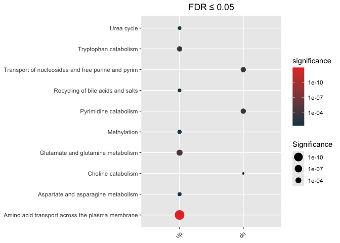
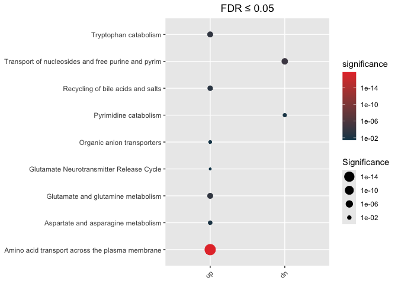

<!-- README.md is generated from README.Rmd. Please edit that file -->

# hypeR.GEM


`hypeR.GEM` maps metabolite signatures to enzyme-coding genes using
genome-scale metabolic models (GEMs), then performs gene set enrichment
analysis in the mapped gene space. The package is designed for
metabolomics studies where the goal is to infer reaction-based links
between metabolites and enzyme-coding genes, enabling the mapping of
metabolite signatures to gene signatures and their subsequent annotation
via gene set enrichment analysis.

## What the package does

- Maps RefMet-annotated metabolites to enzyme-coding genes through GEMs
- Supports non-directional and directional reaction-based mapping
- Quantifies gene-level specificity to reduce the impact of promiscuous
  genes
- Performs unweighted or weighted hypergeometric enrichment analysis
- Provides plotting and export utilities for downstream interpretation

## Installation

Install the development version from GitHub:

``` r
library(devtools)
devtools::install_github("montilab/hypeR-GEM")
```

Then load the package:

``` r
library(hypeR.GEM)
```

## Quick start

This example uses metabolite signatures from human urine samples in
COVID-19. By the end of this example, you will map metabolites to
enzyme-coding genes and identify enriched biological pathways from the
mapped gene signatures.

### 1. Load example data

`COVID_urine` is a named list with two signatures:

- `up`: up-regulated metabolites
- `dn`: down-regulated metabolites

Each signature is a data frame containing a RefMet annotation column
named `refmet_name`.

``` r
data(COVID_urine)
str(COVID_urine, max.level = 1)
List of 2
 $ up:'data.frame': 161 obs. of  5 variables:
 $ dn:'data.frame': 206 obs. of  5 variables:
```

### 2. Check the expected input format

`signature2gene()` expects a named list of data frames. Each data frame
should contain a column matching `reference_key` such as `refmet_name`.

``` r
head(COVID_urine$up)
                     metabolite              refmet_name            estimate
1 (S)-a-amino-omega-caprolactam L-2-aminohexano-6-lactam 0.29434017200000001
2  1,5-anhydroglucitol (1,5-AG)      1,5-Anhydrosorbitol  2.5732795230000001
3               1-methyladenine          1-Methyladenine 0.71437854700000003
4               1-methylguanine          1-Methylguanine         1.168429911
5          1-methylhypoxanthine     1-Methylhypoxanthine  1.0074942360000001
6             2'-deoxyguanosine           Deoxyguanosine  3.0809551019999999
  P_value_adjust gene_type
1   7.266576e-03        up
2   1.930000e-11        up
3   3.140546e-02        up
4   1.292721e-02        up
5   2.660084e-02        up
6   1.960000e-08        up
```

### 3. Map metabolites to genes with `signature2gene()`

The main function in the package is `signature2gene()`.

Key arguments:

- `signatures`: named list of metabolic signatures
- `species`: built-in GEM species (`"Human"`, `"Mouse"`, `"Rat"`,
  `"Zebrafish"`, `"Worm"`, or `"Other"`)
- `directional`: if `TRUE`, only reactions producing the metabolite are
  used; if `FALSE`, both reactant and product relationships are used
- `promiscuous_threshold`: filters metabolites associated with many
  genes
- `reference_key`: metabolite annotation column used for matching to the
  GEM
- `background`: background size used in the gene-specific hypergeometric
  test; by default, this is set to the total number of metabolites
  represented in the GEM

``` r
## Non-directional mapping
hypeR_GEM_obj <- hypeR.GEM::signature2gene(signatures = COVID_urine,
                                           directional = FALSE,
                                           promiscuous_threshold = 500,
                                           reference_key = 'refmet_name',
                                           background = NULL)


## Directional mapping
hypeR_GEM_obj_di <- hypeR.GEM::signature2gene(signatures = COVID_urine,
                                              directional = TRUE,
                                              promiscuous_threshold = 500,
                                              reference_key = 'refmet_name',
                                              background = NULL)
```

The returned object contains:

- `promiscuous_met`: metabolites filtered as overly connected
- `mapped_metabolite_signatures`: metabolites matched in the GEM
- `gene_tables`: ranked enzyme-coding genes for each mapeed
  enzyme-coding signature

``` r
names(hypeR_GEM_obj)
[1] "promiscuous_met"              "mapped_metabolite_signatures"
[3] "gene_tables"                 
head(hypeR_GEM_obj$mapped_metabolite_signatures$up)
      name               fullname                refmet_name gene_association
1 MAM00654 2-hydroxyphenylacetate 2-Hydroxyphenylacetic acid                2
2 MAM00664 2-methylbutyrylglycine     2-Methylbutyrylglycine                4
3 MAM00672       2-oxoglutaramate     2-Keto-glutaramic acid                4
4 MAM00775  3-hydroxyanthranilate  3-Hydroxyanthranilic acid                3
5 MAM00788 3-hydroxy-L-kynurenine          Hydroxykynurenine                7
6 MAM00952   4-acetamidobutanoate   4-Acetamidobutanoic acid                6
     formula exact_mass   super_class               main_class
1     C8H8O3   152.0473 Organic acids         Phenylpropanoids
2   C7H13NO3   159.0895 Organic acids Amino acids and peptides
3    C5H7NO4   145.0375 Organic acids               Keto acids
4    C7H7NO3   153.0426    Benzenoids                 Benzenes
5 C10H12N2O4   224.0797 Organic acids Amino acids and peptides
6   C6H11NO3   145.0739 Organic acids Amino acids and peptides
               sub_class
1         Cinnamic acids
2            Amino acids
3 Short-chain keto acids
4   Hydroxybenzoic acids
5            Amino acids
6            Amino acids
head(hypeR_GEM_obj$gene_tables$up)
             name  symbol associated_reactions total_association
1 ENSG00000158104     HPD                    2                 6
2 ENSG00000155380 SLC16A1                   80                20
3 ENSG00000149124   GLYAT                   11                23
4 ENSG00000156689 GLYATL2                    5                13
5 ENSG00000166840 GLYATL1                    5                13
6 ENSG00000165970  SLC6A5                    5                 6
  signature_association signature_size background      p_value          fdr
1                     1             51       4112 0.0021917226 0.0045978653
2                     1             51       4112 0.0248516626 0.0264962579
3                     3             51       4112 0.0001562584 0.0009573578
4                     2             51       4112 0.0004710983 0.0023025593
5                     2             51       4112 0.0004710983 0.0023025593
6                     1             51       4112 0.0021917226 0.0045978653
  one_minus_p_value one_minus_fdr
1         0.9978083     0.9954021
2         0.9751483     0.9735037
3         0.9998437     0.9990426
4         0.9995289     0.9976974
5         0.9995289     0.9976974
6         0.9978083     0.9954021
                                   associated_metabolites
1                              2-Hydroxyphenylacetic acid
2                              2-Hydroxyphenylacetic acid
3 2-Methylbutyrylglycine;Isobutyrylglycine;Suberylglycine
4                2-Methylbutyrylglycine;Isobutyrylglycine
5                2-Methylbutyrylglycine;Isobutyrylglycine
6                                  2-Methylbutyrylglycine
```

### 4. Run gene set enrichment analysis

Here we use the REACTOME gene sets as an example. The background used in
this analysis is set to all enzyme-coding genes in the Human GEM model
(for more details, see
[here](https://www.pnas.org/doi/abs/10.1073/pnas.2102344118)).

``` r
data(reactome)
```

#### 4.1 Unweighted (standard) hypergeometric test

``` r
## Enrichment analysis from non-directional mapping
enrichment_obj <- hypeR.GEM::enrichment(hypeR_GEM_obj,
                                        genesets = reactome,
                                        genesets_name = "REACTOME",
                                        method='unweighted',
                                        min_metabolite = 2,
                                        background=3068)

## Enrichment analysis from directional mapping
enrichment_obj_di <- hypeR.GEM::enrichment(hypeR_GEM_obj_di,
                                           genesets = reactome,
                                           genesets_name = "REACTOME",
                                           method='unweighted',
                                           min_metabolite = 2,
                                           background=3068)
```

The enrichment result is a list with one element per input signature.
Each element contains:

- `info`: metadata about the test
- `data`: pathway-level enrichment results

``` r
## Taking the enrichment object from non-directional mapping as an example
names(enrichment_obj)
[1] "up" "dn"
head(enrichment_obj$up$data)
                                                                                          label
Amino acid transport across the plasma membrane Amino acid transport across the plasma membrane
Glutamate and glutamine metabolism                           Glutamate and glutamine metabolism
Tryptophan catabolism                                                     Tryptophan catabolism
Methylation                                                                         Methylation
Aspartate and asparagine metabolism                         Aspartate and asparagine metabolism
Urea cycle                                                                           Urea cycle
                                                   pval     fdr signature
Amino acid transport across the plasma membrane 7.4e-17 1.2e-13       435
Glutamate and glutamine metabolism              1.0e-07 5.3e-05       435
Tryptophan catabolism                           1.8e-06 6.9e-04       435
Methylation                                     2.2e-05 6.9e-03       435
Aspartate and asparagine metabolism             4.5e-05 1.2e-02       435
Urea cycle                                      9.0e-05 1.9e-02       435
                                                geneset overlap background
Amino acid transport across the plasma membrane      33      26       3068
Glutamate and glutamine metabolism                   14      11       3068
Tryptophan catabolism                                14      10       3068
Methylation                                          14       9       3068
Aspartate and asparagine metabolism                  12       8       3068
Urea cycle                                           10       7       3068
                                                                                                                                                                                                                                            gene_hits
Amino acid transport across the plasma membrane SLC16A10;SLC1A4;SLC36A1;SLC36A2;SLC36A4;SLC38A1;SLC38A2;SLC38A4;SLC3A1;SLC3A2;SLC43A1;SLC43A2;SLC6A14;SLC6A15;SLC6A18;SLC6A19;SLC6A20;SLC7A1;SLC7A11;SLC7A2;SLC7A3;SLC7A5;SLC7A6;SLC7A7;SLC7A8;SLC7A9
Glutamate and glutamine metabolism                                                                                                                                                      ALDH18A1;GLS;GLS2;GLUD1;GLUD2;GLUL;GOT2;KYAT1;OAT;PYCR1;PYCR2
Tryptophan catabolism                                                                                                                                                                     AADAT;AFMID;HAAO;KMO;KYAT1;KYAT3;KYNU;SLC36A4;SLC3A2;SLC7A5
Methylation                                                                                                                                                                                        AS3MT;COMT;MAT1A;MAT2A;MAT2B;MTRR;N6AMT1;NNMT;TPMT
Aspartate and asparagine metabolism                                                                                                                                                                  ASNS;ASPA;ASPG;GOT1;GOT2;NAT8L;SLC25A12;SLC25A13
Urea cycle                                                                                                                                                                                                   ARG1;ARG2;ASS1;NAGS;OTC;SLC25A15;SLC25A2
                                                                                                                                                                                   metabolite_hits
Amino acid transport across the plasma membrane                                  Hydroxykynurenine;Ornithine;Phenylalanine;Proline;Aspartic acid;Glutamic acid;Cystine;Glycocholic acid;Kynurenine
Glutamate and glutamine metabolism                                  2-Keto-glutaramic acid;Hydroxykynurenine;Kynurenic acid;Glutamic acid;Kynurenine;Aspartic acid;Phenylalanine;Ornithine;Proline
Tryptophan catabolism                           2-Keto-glutaramic acid;Hydroxykynurenine;Kynurenic acid;Glutamic acid;Kynurenine;3-Hydroxyanthranilic acid;Ornithine;Phenylalanine;Proline;Cystine
Methylation                                                                                                                                                 Homovanillic acid;S-Adenosylmethionine
Aspartate and asparagine metabolism                                                                                                                      Aspartic acid;Glutamic acid;Phenylalanine
Urea cycle                                                                                                                                Aspartic acid;Glutamic acid;N-Acetylmethionine;Ornithine
                                                num_met_hits ratio_met_hits
Amino acid transport across the plasma membrane            9          0.176
Glutamate and glutamine metabolism                         9          0.176
Tryptophan catabolism                                     10          0.196
Methylation                                                2          0.039
Aspartate and asparagine metabolism                        3          0.059
Urea cycle                                                 4          0.078
```

#### 4.2 Weighted hypergeometric test

`hypeR.GEM` also supports weighted enrichment, in which gene-specificity
scores are used to weight genes before testing for pathway enrichment.
For a more detailed explanation of the weighting scheme and workflow,
see `vignette("Workflow", package = "hypeR.GEM")`.

``` r
enrichment_obj_wt <- hypeR.GEM::enrichment(hypeR_GEM_obj,
                                           genesets = reactome,
                                           genesets_name = "REACTOME",
                                           method='weighted',
                                           weighted_by = 'fdr',
                                           sigmoid_transformation = TRUE,
                                           min_metabolite = 2,
                                           background=3068)
```

### 5. Visualize the results

``` r
max_fdr <- 0.05
```

#### 5.1 Non-directional

``` r
hypeR.GEM::enrichment_plot(enrichment_obj,
                           top=40,
                           abrv=50,
                           size_by="significance",
                           fdr_cutoff= max_fdr,
                           val='fdr') +
  ggplot2::ggtitle(paste("FDR ≤", max_fdr))
```

<!-- -->

#### 5.2 Directional

``` r
hypeR.GEM::enrichment_plot(enrichment_obj_di,
                           top=40,
                           abrv=50,
                           size_by="significance",
                           fdr_cutoff= max_fdr,
                           val='fdr')+
  ggplot2::ggtitle(paste("FDR ≤", max_fdr))
```

<!-- -->

## Learn more

For a fuller tutorial, methodological background, and a more detailed
workflow, see the package vignette:

- `vignette("Workflow", package = "hypeR.GEM")`

Related publication:

- [Huang et
  al.](https://www.biorxiv.org/content/10.64898/2025.12.08.692998v1)
