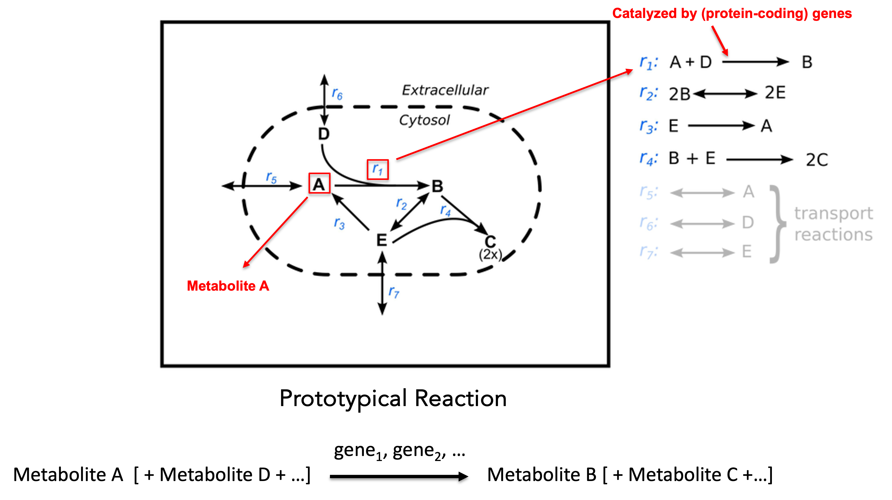
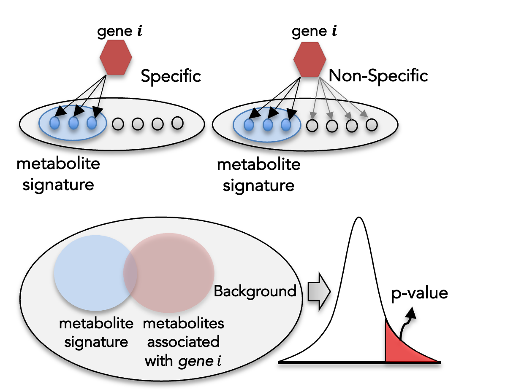

```{r setup, include=FALSE}
knitr::opts_chunk$set(
  echo = TRUE,
  message = FALSE,
  warning = FALSE
)
```

```{r}
devtools::load_all(".")
```

# Overview

This vignette introduces the conceptual framework behind `hypeR.GEM` and walks
through a complete analysis workflow, from mapping metabolite signatures to
enzyme-coding genes through downstream gene set enrichment analysis and
visualization. By the end of the vignette, you will have seen how to:

- map RefMet-annotated metabolites to genes using GEMs
- inspect the resulting metabolite- and gene-level outputs
- perform unweighted and weighted enrichment analysis
- visualize results with dot plots, interative tables, and Sankey diagrams

# What are genome-scale metabolic models (GEMs)?

Genome-scale metabolic models(GEMs) are curated metabolic models collect all known metabolic information of a biological system(e.g. bacteria, human cell, etc.). A GEM typically contains three essential components:

 - **metabolites**: all known metabolites of a biological system.
 - **reactions**: all known reactions of a biological system.
 - **enzyme-coding genes**: enzymes that catalyze the biological reactions. 

Within a GEM, each metabolite is associated with one or more reactions in which
it participates as either a reactant or a product. Each reaction, in turn, is
catalyzed by one or more enzyme-coding genes, with exceptions such as exchange
reactions and some transport reactions that are not enzyme-catalyzed.
`hypeR.GEM` leverages this metabolite-reaction-gene information to connect
metabolite signatures to enzyme-coding genes in a biologically interpretable
way.

For methodological background, see the related
[publication](https://www.pnas.org/doi/abs/10.1073/pnas.2102344118).

A schematic representation of a GEM is shown below:

```{r echo=FALSE, out.height="80%", out.width="80%"}

```

In the diagram, capital letters denote metabolites, and $r_{i}$ denotes the
$i^{th}$ reaction. A prototypical metabolic reaction contains three main
elements:

- **reactants (substrates)**: metabolites consumed by the reaction
- **products**: metabolites produced by the reaction
- **catalyst**: enzyme-coding genes whose protein products catalyze the reaction

For example, reaction $r_{1}$ consumes metabolites $A$ and $D$, produces
metabolite $B$, and may be catalyzed by one or more enzyme-coding genes.

# Mapping workflow

To map a metabolite to its associated enzyme-coding genes, `hypeR.GEM` defines
three related associations:

- **metabolite-reaction association**: a metabolite is associated with a
  reaction if the metabolite is either a reactant or a product
  (**non-directional**) or, under directional mapping, only if the metabolite
  is a product (**directional**)
- **reaction-enzyme(-coding) gene association**: a reaction is associated with
  the enzyme-coding genes that encode enzymes catalyzing that reaction
- **metabolite-enzyme(-coding) gene association**: a metabolite is associated
  with all enzyme-coding genes that catalyze reactions in which the metabolite
  participates

The overall workflow is illustrated below:

```{r echo=FALSE, out.height="80%", out.width="80%"}
knitr::include_graphics("figs/mapping.png")
```

Given an input metabolic signature, a set of metabolites annotated using the
**RefMet** nomenclature, `hypeR.GEM` identifies the metabolic reactions in
which each metabolite participates. For reversible reactions, metabolites are
treated as both reactants and products. The associated enzyme-coding genes are
then mapped to each metabolite according to one of two configurable rules:

- **non-directional mapping** considers all reactions involving the metabolite
- **directional mapping** restricts the association to reactions that produce
  the metabolite, based on the stoichiometry encoded in the model

# Accounting for gene specificity

Enzyme-coding genes differ substantially in reaction specificity. Promiscuous
genes can catalyze a broad range of reactions, giving rise to dense
gene-reaction-metabolite connections and consequently weaker, less specific
associations with a given metabolic signature. To quantify gene-level
specificity and mitigate the influence of promiscuous genes, `hypeR.GEM`
computes a **gene-specificity score** based on the hypergeometric distribution.

```{r echo=FALSE, out.height="80%", out.width="80%"}

```

For each gene $g_{i}$, let $M$ denote the total number of metabolites
represented in the GEM, $S$ the number of metabolites in the input signature,
$A_{i}$ the number of metabolites associated with $g_{i}$, and $a_{i}$ the
number of those metabolites that overlap with the signature. The significance
score $s_{i}$ is defined as the upper-tail hypergeometric probability of
observing at least $a_{i}$ overlapping metabolites by chance:

$$
s_i = P(X \ge a_i)
= \sum_{x = a_i}^{\min(A_i, S)}
\frac{\binom{A_i}{x}\binom{M - A_i}{S - x}}{\binom{M}{S}}
$$

Smaller values of $s_{i}$ indicate a more specific association between gene
$g_{i}$ and the metabolic signature.

# Sigmoid-based weighting of gene specificity

To incorporate gene-specificity information into downstream enrichment
analyses, each gene is assigned a continuous weight $w_{i} \in [0, 1]$ via a
sigmoid transformation of its significance score:

$$
w_i = \frac{1}{1 + e^{a\left(\log_{10}(s_i) - b\right)}}
$$

This transformation is **monotonic and bounded**, ensuring that genes with
stronger specificity (smaller $s_{i}$) receive larger weights, while genes with
weak or non-specific associations are smoothly down-weighted.

The parameter $b$ determines the **inflection point** of the curve, that is,
the half-point where $w_{i} = 0.5$. By default, $b = -1$, corresponding to a
half-point at $s_{i} = 0.1$.

The parameter $a > 0$ regulates the **steepness** of the curve. Larger values
of $a$ produce a sharper transition, whereas smaller values yield a smoother
weighting scheme. The default value $a = 1$ provides a balanced compromise
between sensitivity and smoothness.

# Alternative weighting scheme

For additional flexibility, `hypeR.GEM` also supports a linear weighting scheme
based directly on the significance score:

$$
w_i = 1 - s_{i}
$$

This assigns weights proportional to the complement of the gene-specificity
score.

# Weighted hypergeometric test

The standard hypergeometric test used in over-representation analysis (ORA)
evaluates whether a gene set contains more genes associated with a given
category, such as a pathway or ontology term, than expected by chance. In its
standard form, this approach assumes that all genes contribute equally to the
enrichment signal.

However, as described above, enzyme-coding genes mapped through GEMs can differ
substantially in their association specificity with a given metabolic
signature. To incorporate this heterogeneity, `hypeR.GEM` extends the standard
hypergeometric test to a weighted formulation that accounts for gene-specific
association strengths.

Formally, the probability of observing at least \(k\) overlapping genes between
a gene set and the input signature under the standard hypergeometric model is
given by:

$$
P(X \ge k)
= \sum_{j = k}^{n}
\frac{\binom{K}{j}\binom{N - K}{n - j}}{\binom{N}{n}},
$$

where \(N\) denotes the background size, \(n\) is the number of GEM-mapped
enzyme-coding genes in the signature, \(K\) is the size of the gene set, and
\(k\) is the number of overlapping genes.

In the weighted formulation, each gene \(i\) is assigned a weight
\(w_i \in [0,1]\) reflecting its association specificity. The effective
signature size and overlap are then defined as continuous, weight-adjusted
counts:

$$
n_w = \sum_{i \in n} w_i,
\qquad
k_w = \sum_{i \in k} w_i.
$$

Because the hypergeometric distribution is defined for integer-valued inputs,
these quantities are rounded to the nearest integer using standard rounding:

$$
n_w = \left\lfloor \tfrac{1}{2} + \sum_{i \in n} w_i \right\rfloor,
\qquad
k_w = \left\lfloor \tfrac{1}{2} + \sum_{i \in k} w_i \right\rfloor,
$$

where \(\lfloor \cdot \rfloor\) denotes the floor operator.

Substituting \(n_w\) and \(k_w\) into the hypergeometric test yields a weighted
enrichment score that down-weights non-specific genes, thereby reducing noise
and limiting spurious enrichments.

# Workflow illustration

We next illustrate the workflow using metabolite signatures associated with
coronavirus disease 2019 (COVID-19), derived from human urine samples (see the
[source study](https://www.sciencedirect.com/science/article/pii/S2211124721017836#da0010)).
This study profiled the urinary metabolome of 71 patients with COVID-19 and 27
healthy controls. The publicly available COVID-19-associated metabolites were
classified into two signatures: up-regulated and down-regulated.

## Load the metabolite signature

```{r}
data(COVID_urine)
```

## HypeR-GEM mapping

The core function in **hypeR-GEM** is `signature2gene()`, which maps metabolite signatures to enzyme-coding genes using GEMs. The function takes the following key arguments:

- `signature`: A list of metabolic signatures. Each element must be a data frame containing a column whose name matches the `reference_key` argument, , which specifies the **RefMet** annotation for each metabolite.

- `directional`: Logical argument specifying the metabolite–reaction mapping rule.
  - If `TRUE`, metabolites are mapped only to reactions in which they appear as products (directional mapping).
  - If `FALSE`, metabolites are mapped to reactions in which they appear as either reactants or products (non-directional mapping).

- `promiscuous_threshold`: A data frame listing metabolites considered promiscuous, i.e., those associated with an excessively large number of genes. The filtering threshold is defined by the `promiscuous_threshold` parameter in `signature2gene()`.

- `background`: Background used in the gene-specific hypergeometric test. By default, this is set to the total number of metabolites represented in the GEM.

- `reference_key`: A character string indicating the column name in each signature data frame that contains **RefMet** metabolite identifiers.

```{r}
## Undirectional mapping
hypeR_GEM_obj <- hypeR.GEM::signature2gene(signatures = COVID_urine, 
                                           directional = FALSE,
                                           promiscuous_threshold = 100, 
                                           reference_key = 'refmet_name',
                                           background = NULL)

##Directional mapping
hypeR_GEM_obj_di <- hypeR.GEM::signature2gene(signatures = COVID_urine,
                                              directional = TRUE,
                                              promiscuous_threshold = 100,
                                              reference_key = 'refmet_name',
                                              background = NULL)
```

## Inspect the mapping output {.tabset}

Here, we illustrate the output of `signature2gene()` using the results from
non-directional mapping. The returned object contains three major components:

- `promiscuous_met`: a data frame of metabolites considered overly connected
  based on the `promiscuous_threshold`
- `mapped_metabolite_signatures`: a list in which each element corresponds to a
  metabolite signature and contains the matched metabolites in the GEM
- `gene_tables`: a list in which each element corresponds to a metabolite
  signature and contains the mapped enzyme-coding genes

### `promiscuous_met`

```{r}
head(hypeR_GEM_obj$promiscuous_met)
```

### `mapped_metabolite_signatures`

Because `COVID_urine` contains up-regulated and down-regulated signatures,
`mapped_metabolite_signatures` is a list of length two. Below we inspect the
up-regulated signature as an example.

```{r}
head(hypeR_GEM_obj$mapped_metabolite_signatures$up)
```

### `gene_tables`

Similarly, `gene_tables` is also a list of length two. Each data frame reports,
for each mapped gene, the associated reactions, the total and signature-level
associations, and the gene-specificity statistics.

```{r}
head(hypeR_GEM_obj$gene_tables$up)
```

## Enrichment analysis {.tabset}

Here, we use REACTOME gene sets to illustrate downstream enrichment analysis of
the enzyme-coding genes mapped by `hypeR.GEM`.

```{r}
data(reactome)
```

In this example, the background is defined as all enzyme-coding genes
represented in the Human GEM model (see the
[related publication](https://www.pnas.org/doi/abs/10.1073/pnas.2102344118)).
The `enrichment()` function accepts the following key arguments:

- `hypeR_GEM_obj`: the object returned by `signature2gene()`
- `genesets`: a list of gene sets
- `genesets_name`: a descriptive name for the gene-set compendium, such as
  `"REACTOME"`
- `method`: enrichment method; `"unweighted"` applies the standard
  Fisher/hypergeometric test, whereas `"weighted"` applies the weighted
  hypergeometric test
- `weighted_by`: used only when `method = "weighted"`; specifies the column in
  `hypeR_GEM_obj[["gene_tables"]]` that contains the gene-level score used for
  weighting
- `sigmoid_transformation`: logical; if `TRUE`, applies the sigmoid
  transformation to the selected score, whereas if `FALSE`, the raw score is
  used directly
- `min_metabolite`: Additional filtering criterion that specifies the minimum number of metabolites required for enrichment for account for metabolite specificity.

Downstream visualization is supported by `enrichment_plot()` and `rctbls()`.
In this example, pathways such as *Sialic acid metabolism*, *Trafficking and
processing of endosomal TLR*, and *Choline catabolism* appear enriched only
under the unweighted test, suggesting that these signals are primarily driven
by less specific genes.

### Unweighted (standard) hypergeometric test

```{r}
max_fdr <- 0.05

## Enrichment analysis from non-directional mapping
enrichment_obj <- hypeR.GEM::enrichment(
  hypeR_GEM_obj,
  genesets = reactome,
  genesets_name = "REACTOME",
  method = "unweighted",
  min_metabolite = 2,
  background = 3068
)

p <- hypeR.GEM::enrichment_plot(
  enrichment_obj,
  top = 40,
  abrv = 50,
  size_by = "significance",
  fdr_cutoff = max_fdr,
  val = "fdr"
) +
  ggplot2::ggtitle(paste("FDR ≤", max_fdr)) 

p
```

### Reactable table

```{r}
rctbls(enrichment_obj)
```

### Weighted hypergeometric test

```{r}
max_fdr <- 0.05

## Enrichment analysis from non-directional mapping
enrichment_obj_wt <- hypeR.GEM::enrichment(
  hypeR_GEM_obj,
  genesets = reactome,
  genesets_name = "REACTOME",
  method = "weighted",
  weighted_by = "fdr",
  sigmoid_transformation = TRUE,
  min_metabolite = 2,
  background = 3068
)

p <- hypeR.GEM::enrichment_plot(
  enrichment_obj_wt,
  top = 40,
  abrv = 50,
  size_by = "significance",
  fdr_cutoff = max_fdr,
  val = "fdr"
) +
  ggplot2::ggtitle(paste("FDR ≤", max_fdr)) 

p
```

### Reactable table

```{r}
rctbls(enrichment_obj_wt)
```

## Sankey diagram

The `sankey_plot()` function generates a three-layer Sankey diagram connecting
metabolites, metabolite sets (MSets), and gene sets (GSets) derived from
`hypeR.GEM`. Edge weights between the metabolite and MSet layers reflect the
number of shared metabolites, while edges between the MSet and GSet layers
reflect the overlap between `hypeR.GEM`-mapped genes and genes in each GSet.

Key arguments include:

- `hypeR_GEM_obj`: the object returned by `signature2gene()`
- `msets_list`: a list of metabolite sets; each element should be a named list
  where names are set names and values are character vectors of metabolite
  identifiers matching `key`
- `gsets_list`: a list of gene sets; each element should be a named list where
  names are set names and values are character vectors of gene identifiers
- `key`: column name in `hypeR_GEM_obj[["mapped_metabolite_signatures"]]` used
  as the metabolite identifier

As an illustrative example, we apply this function to `hypeR_object_NECS`,
constructed from age-associated metabolites identified in the New England
Centenarian Study (NECS) (see the [study website](https://www.bumc.bu.edu/centenarian/)).
A curated subset of enriched metabolite sets and a curated subset of enriched
gene sets derived from `hypeR.GEM`-mapped genes are visualized in an
integrative multi-omics context.

```{r}
data("hypeR_object_NECS")
data("metabolon_msets_list")
data("gsets_list")

p <- sankey_plot(
  hypeR_object_NECS,
  msets_list = list(metabolon_msets_list$metabolonSupPthwy),
  gsets_list = list(gsets_list$hallmark),
  key = "refmet_name",
  font_size = 16,
  node_width = 20
)

p
```

## Export results to Excel files

Mapping results can be exported to Excel files using `hypGEM_to_excel()`:

```{r, eval = FALSE}
hypGEM_to_excel(hypeR_GEM_obj, file = "hypeR_GEM_non_directional.xlsx")
hypGEM_to_excel(hypeR_GEM_obj_di, file = "hypeR_GEM_directional.xlsx")
```
